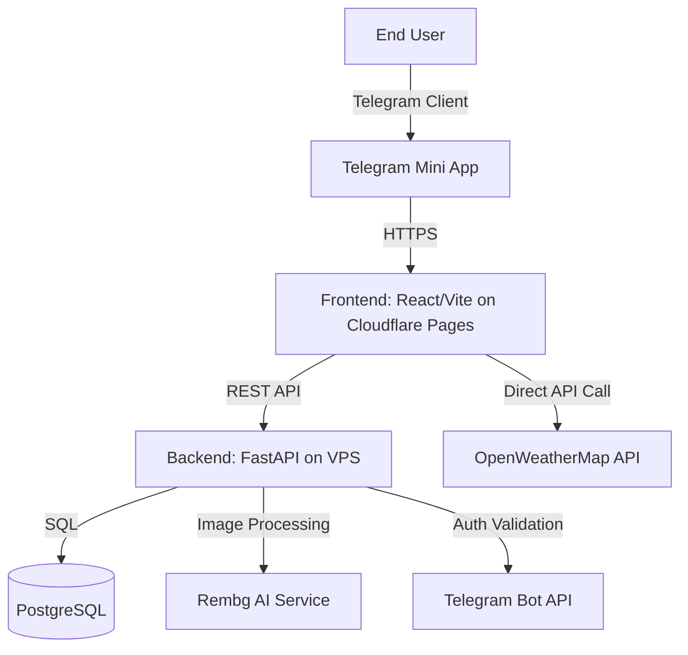

<!-- Improved compatibility of back to top link -->
<a id="readme-top"></a>

<!-- PROJECT SHIELDS -->
[![Contributors][contributors-shield]][contributors-url]
[![Forks][forks-shield]][forks-url]
[![Issues][issues-shield]][issues-url]
[![MIT License][license-shield]][license-url]
[![CI Status][ci-shield]][ci-url]

<!-- PROJECT LOGO -->
<br />
<div align="center">
  <a href="https://t.me/digital_wardrobe_app_bot">
    
  </a>

  <h3 align="center">Digital Wardrobe</h3>

  <p align="center">
    Telegram Mini App for personal wardrobe management with AI background removal, weather integration, and calendar-based outfit planning.
    <br />
    <a href="https://veronika1977.github.io/digital_wardrobe_team_44/"><strong>Explore the docs »</strong></a>
    <br />
    <br />
    <a href="https://t.me/digital_wardrobe_app_bot">Try Live Product</a>
    ·
    <a href="https://drive.google.com/drive/folders/1QmeQpMIMS3NxZ2RVd2gaNRPiYpNO2f7B?usp=sharing">Watch Demo</a>
    ·
    <a href="https://github.com/veronika1977/digital_wardrobe_team_44/issues">Report Bug</a>
    ·
    <a href="https://github.com/veronika1977/digital_wardrobe_team_44/issues">Request Feature</a>
  </p>
</div>

<!-- TABLE OF CONTENTS -->
<details>
  <summary>Table of Contents</summary>
  <ol>
    <li><a href="#about-the-project">About The Project</a></li>
    <li><a href="#built-with">Built With</a></li>
    <li><a href="#project-context">Project Context</a></li>
    <li><a href="#getting-started">Getting Started</a></li>
    <li><a href="#usage">Usage</a></li>
    <li><a href="#roadmap">Roadmap</a></li>
    <li><a href="#quality--assurance">Quality & Assurance</a></li>
    <li><a href="#architecture">Architecture</a></li>
    <li><a href="#contributing">Contributing</a></li>
    <li><a href="#license">License</a></li>
    <li><a href="#contact">Contact</a></li>
  </ol>
</details>

<!-- ABOUT THE PROJECT -->
## About The Project

[![Product Screenshot][product-screenshot]](reports/week6/images/main.png)

**Goal:** Help users easily organize their wardrobe directly in Telegram, without complex registration or extra apps.

**Description:** Digital Wardrobe is a full-stack Telegram Mini App that allows users to catalog clothing items, remove backgrounds automatically, plan outfits on a calendar, and receive daily wear reminders. Built with a decoupled React frontend and FastAPI backend, deployed via Cloudflare Pages and Docker Compose.

### Technology Stack
- **Frontend:** React + TypeScript + Vite
- **Backend:** Python (FastAPI) + Rembg
- **Deployment:** Cloudflare Pages (Frontend), Local (Backend for development)

<p align="right">(<a href="#readme-top">back to top</a>)</p>

<!-- BUILT WITH -->

### Built With

* [![React][React.js]][React-url]
* [![TypeScript][TypeScript]][TypeScript-url]
* [![Vite][Vite]][Vite-url]
* [![FastAPI][FastAPI]][FastAPI-url]
* [![Python][Python]][Python-url]
* [![PostgreSQL][PostgreSQL]][PostgreSQL-url]
* [![Docker][Docker]][Docker-url]
* [![Cloudflare Pages][Cloudflare]][Cloudflare-url]

<p align="right">(<a href="#readme-top">back to top</a>)</p>


<!-- PROJECT CONTEXT -->

## Project Context



**Stakeholders:** End Users, Product Owner/Customer
**External Systems:** Telegram Bot API, OpenWeatherMap, Rembg AI

<p align="right">(<a href="#readme-top">back to top</a>)</p>


<!-- GETTING STARTED -->

## Getting Started

### Prerequisites

- Node.js 18+
- Python 3.10+
- Telegram Bot Token (from [@BotFather](https://t.me/BotFather))

### Installation

**Frontend (Local Development)**

```bash 
git clone https://github.com/veronika1977/digital_wardrobe_777.git
cd digital_wardrobe_777
npm install
npm run dev 
```
**Backend (Local Development Only)**

```bash
git clone https://github.com/Mrxfg/digital-wardrobe.git
cd digital-wardrobe
python -m venv venv
source venv/bin/activate  # On Windows: venv\Scripts\activate
pip install -r requirements.txt

# Set up environment variables
export TELEGRAM_BOT_TOKEN="your_bot_token_here"

# Run the server
python main.py
```
### Production Deployment

- Frontend: Auto-deployed via [Cloudflare Pages](https://pages.cloudflare.com/) on push to `main`
- Backend: Docker Compose on VPS (docker-compose up -d)

<p align="right">(<a href="#readme-top">back to top</a>)</p> 


 <!-- USAGE -->
## Usage

1. Open [@digital_wardrobe_app_bot](https://t.me/digital_wardrobe_app_bot) in Telegram
2. Tap **Start** → automatic login via Telegram
3. **Add items:** Tap `+` → upload photo → fill attributes → save
4. **Plan outfits:** Open `Calendar` → pick date → select items → save
5. **Track wear:** Respond to daily 19:00 bot messages to log worn items

_For more examples, please refer to the [Hosted Documentation](https://veronika1977.github.io/digital_wardrobe_team_44/)_

<p align="right">(<a href="#readme-top">back to top</a>)</p>

<!-- ROADMAP --> 

## Roadmap

### MVP v0 (Week 2 Deliverable)

- [x] [Deployed website version (smoke check)](https://agent-6a29aac2b0946--benevolent-frangollo-a08785.netlify.app)
- [x] [Deployed Telegram version (smoke check)](http://t.me/digital_wardrobe_app_bot/digital_wardrobe_app)

### MVP v1 (Week 3 Deliverable)

- [x] [Live Telegram Mini App](https://t.me/digital_wardrobe_app_bot/digital_wardrobe_app) — main production deployment
- [x] [Live Website Version](https://digwardrobe.netlify.app/) — web preview for testing
- [x] Telegram authentication (no registration required)
- [x] Add clothing items with photo upload
- [x] Tag system (category, season, material, color)
- [x] Filter wardrobe by tags
- [x] Soft delete with 14-day trash retention
- [x] Restore items from trash

### MVP v1.1.0 (Assignment 4 / Sprint 2)

- [x] [SemVer Release v1.1.0](https://github.com/veronika1977/digital_wardrobe_team_44/releases/tag/v1.1.0)
- [x] [Demo Video](https://drive.google.com/drive/folders/11g03djGSts4WhYvRZkQ2ZdtfoOnMf1PW?usp=sharing)
- [x] **US-05:** Capsule Wardrobes — create and manage clothing capsules
- [x] **US-06:** Edit Clothing Item — edit items with soft delete
- [x] **US-08:** Automatic Background Removal — AI-powered background removal with fallback
- [x] **Quality Gates:** CI/CD pipelines, automated tests, QRT, Vulture
- [x] **66% code coverage** (exceeds 30% requirement)
- [x] **64 backend tests + 3 frontend tests**

### MVP v2 (Assignment 5 / Sprint 3)

- [x] [SemVer Release v2.0.0](https://github.com/veronika1977/digital_wardrobe_team_44/releases/tag/v2.0.0)
- [x] **US-12:** Weather Integration — display current weather based on user location with manual fallback
- [x] **US-13:** Calendar Planning — schedule outfits for specific dates with instant UI sync

### MVP v2.1.0 (Assignment 5 / Sprint 4)

- [x] [SemVer Release v2.1.0](https://github.com/veronika1977/digital_wardrobe_team_44/releases/tag/v2.1.0)
- [x] **US-14:** AI Stylist for Outfit Generation
- [x] **US-15:** Telegram Bot Notifications for Daily Outfits

### Future Sprints
- [ ] **Sprint 5:** Outfit sharing by link, AI material detection

See the [open issues](https://github.com/veronika1977/digital_wardrobe_team_44/issues) for a full list of proposed features.

<p align="right">(<a href="#readme-top">back to top</a>)</p>

<!-- QUALITY & ASSURANCE -->

## Quality & Assurance

### Quality Assurance

- **Automated Tests:** 64+ backend unit/integration tests, frontend Vitest suite
- **Coverage:** 66% backend overall, 72-100% critical modules
- **CI Gates:** linting (flake8/ESLint), type-check (mypy/tsc), build, tests, coverage, Lychee link check
- **Additional QA:** Vulture dead-code detection, dependency vulnerability scanning

[Testing Status](docs/testing.md) | [QRT Definitions](docs/quality-requirement-tests.md) | [Backend CI Pipeline](https://github.com/Mrxfg/digital-wardrobe/actions)

<p align="right">(<a href="#readme-top">back to top</a>)</p>

<!-- ARCHITECTURE -->

| View | Description | Link |
| :--- | :--- | :--- |
| **Static** | Component boundaries & interfaces | [View](docs/architecture/static.md) |
| **Dynamic** | Critical flows (auth, upload, weather) | [View](docs/architecture/dynamic.md) |
| **Deployment** | Runtime topology (Cloudflare Pages + Docker) | [View](docs/architecture/deployment.md) |

### Architecture Decision Records (ADRs)

| ADR | Decision | Impact |
| :--- | :--- | :--- |
| [ADR-001](docs/architecture/adr/ADR-001-fastapi-backend.md) | FastAPI + PostgreSQL | Async API, testability via DI |
| [ADR-002](docs/architecture/adr/ADR-002-rembg-background-removal.md) | CPU-based Rembg | Fault tolerance via fallback |
| [ADR-003](docs/architecture/adr/ADR-003-telegram-authentication.md) | Telegram Mini App Auth | JWT/HMAC flow, low-latency UX |
| [ADR-004](docs/architecture/adr/ADR-004-ai-strategy.md) | LLM provider for AI Stylist | AI suggestions with fallback when LLM is unavailable |
| [ADR-005](docs/architecture/adr/ADR-005-bot-architecture.md) | Telegram Bot scheduler | Daily reminders at 19:00 with inline buttons |

[Full Architecture Documentation](docs/architecture/README.md)

<p align="right">(<a href="#readme-top">back to top</a>)</p>

<!-- CONTRIBUTING -->

## Contributing

Contributions are what make the open source community such an amazing place to learn, inspire, and create. Any contributions you make are **greatly appreciated**.

1. Fork the Project
2. Create your Feature Branch (`git checkout -b feature/AmazingFeature`)
3. Commit your Changes (`git commit -m 'Add some AmazingFeature'`)
4. Push to the Branch (`git push origin feature/AmazingFeature`)
5. Open a Pull Request

### Top contributors:

<a href="https://github.com/veronika1977/digital_wardrobe_team_44/graphs/contributors">
  
</a>

[Development Process](docs/development-process.md) | [Definition of Done](docs/definition-of-done.md)

<p align="right">(<a href="#readme-top">back to top</a>)</p>

<!-- CONTACT -->

## Contact

**Team 44 — Digital Wardrobe**

Product: [@digital_wardrobe_app_bot](https://t.me/digital_wardrobe_app_bot)  
Docs: [Hosted Documentation](https://veronika1977.github.io/digital_wardrobe_team_44/)  
Issues: [GitHub Issues](https://github.com/veronika1977/digital_wardrobe_team_44/issues)

Project Link: [https://github.com/veronika1977/digital_wardrobe_team_44](https://github.com/veronika1977/digital_wardrobe_team_44)

<p align="right">(<a href="#readme-top">back to top</a>)</p>

<!-- LICENSE -->

## License

This project is licensed under the **MIT License** — see the [`LICENSE`](LICENSE) file for details.

### MIT License Summary

```text
MIT License

Copyright (c) 2026 Team 44 — Digital Wardrobe

Permission is hereby granted, free of charge, to any person obtaining a copy
of this software and associated documentation files (the "Software"), to deal
in the Software without restriction, including without limitation the rights
to use, copy, modify, merge, publish, distribute, sublicense, and/or sell
copies of the Software, and to permit persons to whom the Software is
furnished to do so, subject to the following conditions:

The above copyright notice and this permission notice shall be included in all
copies or substantial portions of the Software.

THE SOFTWARE IS PROVIDED "AS IS", WITHOUT WARRANTY OF ANY KIND, EXPRESS OR
IMPLIED, INCLUDING BUT NOT LIMITED TO THE WARRANTIES OF MERCHANTABILITY,
FITNESS FOR A PARTICULAR PURPOSE AND NONINFRINGEMENT. IN NO EVENT SHALL THE
AUTHORS OR COPYRIGHT HOLDERS BE LIABLE FOR ANY CLAIM, DAMAGES OR OTHER
LIABILITY, WHETHER IN AN ACTION OF CONTRACT, TORT OR OTHERWISE, ARISING FROM,
OUT OF OR IN CONNECTION WITH THE SOFTWARE OR THE USE OR OTHER DEALINGS IN THE
SOFTWARE.
```

**Why MIT?**
- Simple and permissive — allows commercial use, modification, distribution, and private use
- Compatible with most open source projects
- Protects contributors while giving users freedom

[Choose a License](https://choosealicense.com/licenses/mit/) | [Full License Text](LICENSE)


<p align="right">(<a href="#readme-top">back to top</a>)</p>

<!-- MARKDOWN LINKS & IMAGES -->

[contributors-shield]: https://img.shields.io/github/contributors/veronika1977/digital_wardrobe_team_44.svg?style=for-the-badge
[contributors-url]: https://github.com/veronika1977/digital_wardrobe_team_44/graphs/contributors
[forks-shield]: https://img.shields.io/github/forks/veronika1977/digital_wardrobe_team_44.svg?style=for-the-badge
[forks-url]: https://github.com/veronika1977/digital_wardrobe_team_44/network/members
[issues-shield]: https://img.shields.io/github/issues/veronika1977/digital_wardrobe_team_44.svg?style=for-the-badge
[issues-url]: https://github.com/veronika1977/digital_wardrobe_team_44/issues
[license-shield]: https://img.shields.io/github/license/veronika1977/digital_wardrobe_team_44.svg?style=for-the-badge
[license-url]: https://github.com/veronika1977/digital_wardrobe_team_44/blob/main/LICENSE
[ci-shield]: https://github.com/veronika1977/digital_wardrobe_team_44/actions/workflows/lychee.yml/badge.svg
[ci-url]: https://github.com/veronika1977/digital_wardrobe_team_44/actions/workflows/lychee.yml
[product-screenshot]: reports/week5/images/main_DW.png
[React.js]: https://img.shields.io/badge/React-20232A?style=for-the-badge&logo=react&logoColor=61DAFB
[React-url]: https://reactjs.org/
[TypeScript]: https://img.shields.io/badge/TypeScript-3178C6?style=for-the-badge&logo=typescript&logoColor=white
[TypeScript-url]: https://www.typescriptlang.org/
[Vite]: https://img.shields.io/badge/Vite-646CFF?style=for-the-badge&logo=vite&logoColor=white
[Vite-url]: https://vitejs.dev/
[FastAPI]: https://img.shields.io/badge/FastAPI-009688?style=for-the-badge&logo=fastapi&logoColor=white
[FastAPI-url]: https://fastapi.tiangolo.com/
[Python]: https://img.shields.io/badge/Python-3776AB?style=for-the-badge&logo=python&logoColor=white
[Python-url]: https://www.python.org/
[PostgreSQL]: https://img.shields.io/badge/PostgreSQL-4169E1?style=for-the-badge&logo=postgresql&logoColor=white
[PostgreSQL-url]: https://www.postgresql.org/
[Docker]: https://img.shields.io/badge/Docker-2496ED?style=for-the-badge&logo=docker&logoColor=white
[Docker-url]: https://www.docker.com/
[Cloudflare]: https://img.shields.io/badge/Cloudflare-F38020?style=for-the-badge&logo=cloudflare&logoColor=white
[Cloudflare-url]: https://pages.cloudflare.com/