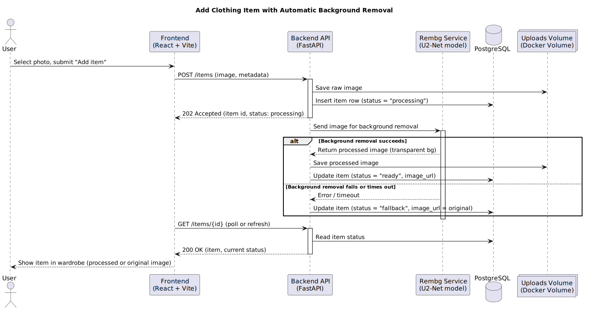
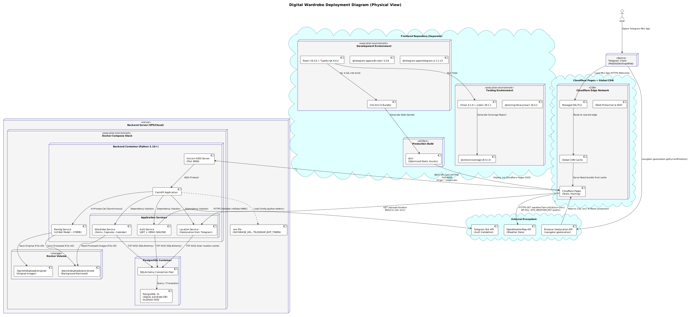

# Architecture Documentation — Digital Wardrobe

This document provides a comprehensive overview of the Digital Wardrobe system architecture using three architectural views: static, dynamic, and deployment.

## Table of Contents

- [Static View](#static-view)
- [Dynamic View](#dynamic-view)
- [Deployment View](#deployment-view)
- [Architecture Decision Records](#architecture-decision-records)

---

## Static View

### Component Diagram

**Source:** [static-view/component-diagram.puml](static-view/component-diagram.puml)

**What this diagram shows:** [TODO: Explain the component diagram]

**Coupling and cohesion:** [TODO: Analyze coupling and cohesion]

**Maintainability implications:** [TODO: Discuss maintainability]

**Quality requirements supported:** [TODO: Link to QRs]

---

## Dynamic View

### Sequence Diagram: Add Clothing Item with Background Removal

**Source:** [dynamic-view/sequence-diagram.puml](dynamic-view/sequence-diagram.puml)

**Scenario:** [TODO: Describe the scenario]

**Why this scenario is important:** [TODO: Explain importance]

**Architecture decisions and quality requirements:** [TODO: Link to ADRs and QRs]

---

## Deployment View — Deployment Diagram

### Rendered Diagram

### PlantUML Source

**Source:** [deployment-view/deployment-diagram.puml](deployment-view/deployment-diagram.puml)

### Diagram Description

The deployment diagram illustrates the physical runtime topology of the Digital Wardrobe system. It highlights a **multi-repository architecture** where the frontend and backend are developed and deployed independently:

1. **User Access Path:** Users access the application via the **Telegram Client** (Mobile/Desktop/Web). The Telegram client loads the frontend application as a **Mini App** (HTTPS Webview).
2. **Frontend Hosting:** The frontend (built with **React 19 + Vite 8**) is hosted on **Cloudflare Pages**, utilizing a global CDN for low-latency delivery of static assets.
3. **Backend Infrastructure:** The backend API (built with **FastAPI**) runs in a **Docker Container** on a VPS. It communicates with a **PostgreSQL 15** database container (via Docker Compose) and stores uploaded images in a local **Docker Volume** (`./backend/uploads/`).
4. **External Integrations:** 
   - Backend communicates with **Telegram Bot API** for authentication validation.
   - Frontend communicates **directly** with **OpenWeatherMap API** after receiving user coordinates from the backend's Location Service (Hybrid Weather Flow).

### Deployment Model Rationale

* **Cloudflare Pages (Frontend):** Chosen for its global edge network (275+ locations), automatic HTTPS management, DDoS protection, and seamless CI/CD integration for static site deployment.
* **Docker Compose (Backend):** Selected to encapsulate the FastAPI application, Rembg dependencies (~170MB U2-Net model), and PostgreSQL database in a reproducible and isolated environment.
* **Local File Storage:** Used for MVP simplicity to avoid complex cloud storage (S3/R2) configuration, with a plan to migrate to object storage for future scalability.

### Operational Considerations

* **Deployment:** Frontend is auto-deployed via Cloudflare Pages CI/CD on `git push`. Backend is deployed to VPS via Docker Compose.
* **Storage:** The `uploads` volume must be backed up regularly to preserve user photos.
* **Security:** Secrets (`.env`) are managed securely on the server and never committed to version control. The frontend uses a public/read-only OpenWeatherMap key (`VITE_WEATHER_API_KEY`).
* **Scaling:** Current setup is a single-node deployment. Future scaling involves separating the database, migrating storage to S3, and adding load balancers for backend instances.

### How Deployment Supports Quality Requirements

| Quality Requirement | Deployment Support | Evidence |
| :--- | :--- | :--- |
| **QR-001: Time Behaviour (< 3s)** | Cloudflare CDN minimizes frontend load time. FastAPI async architecture handles concurrent requests efficiently. Direct frontend-to-weather-API calls reduce backend proxy latency. | Load testing reports, CI/CD metrics. |
| **QR-002: Fault Tolerance** | Docker Compose ensures automatic container restarts on failure. Rembg fallback logic preserves original images if AI processing fails. Weather API failures degrade gracefully (frontend shows cached/default state). | Integration tests verifying fallback behavior. |
| **QR-003: Testability** | Isolated Docker containers allow independent testing of API and DB. Mock services used for external APIs during CI. Frontend Vitest suite runs in isolated jsdom environment. | Unit test coverage reports (`coverage/` folder). |

### Link to Architecture Decisions
* [ADR-001: FastAPI + PostgreSQL Backend](adr/ADR-001-fastapi-backend.md)
* [ADR-002: Rembg for Background Removal](adr/ADR-002-rembg-background-removal.md)
* [ADR-003: Telegram Authentication](adr/ADR-003-telegram-authentication.md)

## Architecture Decision Records (Summary)
The following ADRs document key architectural decisions and how they fit together:

| ADR | Decision | Impact on Architecture & Quality Requirements |
| :--- | :--- | :--- |
| **[ADR-001](adr/ADR-001-fastapi-backend.md)** | FastAPI + PostgreSQL | Defines the core backend runtime, async API layer, and data persistence strategy. Enables QR-001 (performance) and QR-003 (testability via dependency injection). |
| **[ADR-002](adr/ADR-002-rembg-background-removal.md)** | CPU-based Rembg | Dictates the Docker container size (~170MB model) and requires local file storage (`uploads/`). Directly supports QR-002 (fault tolerance via fallback). |
| **[ADR-003](adr/ADR-003-telegram-authentication.md)** | Telegram Mini App Auth | Drives the Cloudflare Pages deployment (hosting the Mini App UI) and dictates the JWT/HMAC flow between Telegram, Frontend, and Backend. |

**How architecture and decisions fit together:**  
The three views (Static, Dynamic, Deployment) and three ADRs form a cohesive architectural baseline. The **Deployment View** shows *where* components run (Cloudflare + Docker Compose), the **Static View** shows *how* they are structured logically (React UI → FastAPI Services → PostgreSQL), and the **Dynamic View** traces *critical flows* (Auth → Upload → Rembg → Weather). Together with the ADRs, they justify technology choices, map them to Quality Requirements (QR-001/002/003), and provide a traceable foundation for future scaling (e.g., migrating local storage to S3, adding async queues for Rembg).

