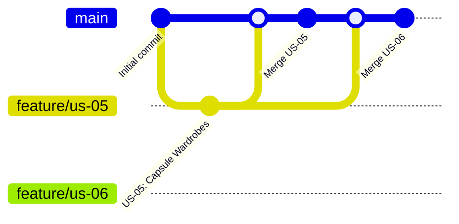

# Development Process — Digital Wardrobe

This document describes the team's development workflow, Sprint process, and configuration management practices.

## Git Workflow

**Explanation:** [TODO: Explain what the diagram shows and how the team uses this workflow]

## Sprint Workflow

[TODO: Describe Sprint planning, daily standups, review, retrospective]

## Work Status Transitions

[TODO: Describe To Do → Ready → In Progress → Review → Done]
Configuration Management

[TODO: Describe how the team manages configuration, secrets, environment variables]

## Definition of Done

[Definition of Done](definition-of-done.md)

Last updated: [TODO: Date]
Author: @veronika1977
Reviewer: [TODO: Reviewer]