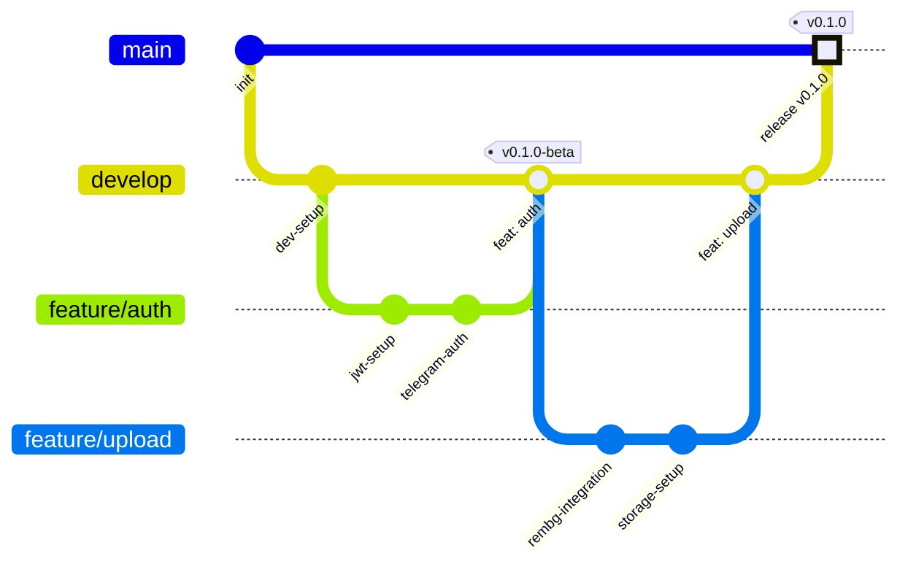
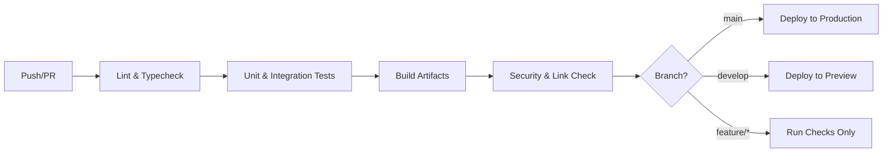

# Development Process & Workflow

This document defines the development workflow, branching strategy, CI/CD pipeline, and code review standards for the Digital Wardrobe project. It ensures consistent quality, traceability, and safe deployment across all repositories.

> **Note:** This project uses a multi-repository architecture. The workflow described here applies uniformly to `digital_wardrobe_777`, `digital-wardrobe`, and this documentation repository (`digital_wardrobe_team_44`).

---

## Branching Strategy

We follow a **Feature Branch Workflow** with protected `main` and `develop` branches:

| Branch | Purpose | Protection |
|--------|---------|------------|
| `main` | Production-ready code, tagged releases | Strict (PR required, 1 review, CI pass) |
| `develop` | Integration branch for upcoming release | Moderate (PR required, CI pass) |
| `feature/*` | New features, refactoring, docs | Standard (merged via PR to `develop`) |
| `hotfix/*` | Critical production fixes | Strict (merged to `main` & `develop`) |

### Git Graph Visualization

## Branch Protection Rules

Configured via GitHub repository settings:

- **Require pull request before merging**
- **Require approvals:** 1 reviewer (maintainer or peer)
- **Dismiss stale reviews** on new commits
- **Require status checks to pass:** `CI/CD Pipeline`, `Test Coverage`, `Lint & Typecheck`
- **Require conversation resolution** before merge
- **Restrict who can push to matching branches:** `main` restricted to admins; `develop` restricted to team members
- **Allow force pushes:** Disabled
- **Allow deletions:** Disabled

## Pull Request & Code Review Process

### 1. PR Creation
- Use the **Pull Request Template** (`.github/pull_request_template.md`)
- Link to related Issue/User Story
- Include: description, testing steps, screenshots (if UI), and risk assessment

### 2. Self-Review Checklist
Before requesting review, the author must verify:
- [ ] Code follows ESLint/Pylint/Black standards
- [ ] All tests pass locally (`npm test` / `pytest`)
- [ ] No console logs, `TODO`s, or dead code
- [ ] Architecture/docs updated (if applicable)
- [ ] Commit messages follow Conventional Commits (`feat:`, `fix:`, `docs:`)

### 3. Peer Review

- Assigned reviewer checks: logic correctness, security, performance, and adherence to ADRs
- Comments must be resolved or acknowledged before merge
- **Squash merge** strategy enabled to keep `main` history clean

### 4. Post-Merge

- Branch auto-deleted
- Linked issue moves to `Done`
- Release notes drafted (if feature branch)

---

## CI/CD Pipeline

Automated via **GitHub Actions**. Workflows are versioned in `.github/workflows/`.

### Pipeline Stages

  ### Key Workflows

| Workflow | Trigger | Steps |
|----------|---------|-------|
| `ci.yml` | `push`, `pull_request` | Lint, typecheck, test, coverage report, PlantUML validation |
| `cd.yml` | `push` to `main`/`develop` | Build, deploy (Cloudflare Pages / Docker), health check |
| `lychee.yml` | `schedule`, `push` | Broken link checker across all markdown/docs |
| `release.yml` | `tag` creation | GitHub Release, changelog update, artifact upload |

### Quality Gates (Block Merge if Failed)

- **Test Coverage:** ≥ 30% on critical modules (Frontend & Backend) *(QR-003 minimum)*
- **Linting:** Zero errors, warnings must be documented
- **Build:** Must compile without warnings
- **Documentation:** `lychee` link check must pass (exclusions allowed via `.lycheeignore`)

---

## Release & Versioning

- **Versioning:** Semantic Versioning (`MAJOR.MINOR.PATCH`)
- **Tags:** Created on `main` after successful merge from `develop`
- **GitHub Releases:** Auto-generated from tags + changelog section
- **Deployment:** 
  - `main` → Production (`digwardrobe.netlify.app` / Cloudflare Pages)
  - `develop` → Staging/Preview URL
  - `feature/*` → No deployment (CI checks only)

---

# Related Documentation

- [Definition of Done](definition-of-done.md)
- [Testing Strategy](testing.md)
- [Quality Requirements](quality-requirements.md)
- [Architecture Decision Records](architecture/README.md#architecture-decision-records-(Summary))
- [GitHub Issue Templates](../.github/ISSUE_TEMPLATE/)

