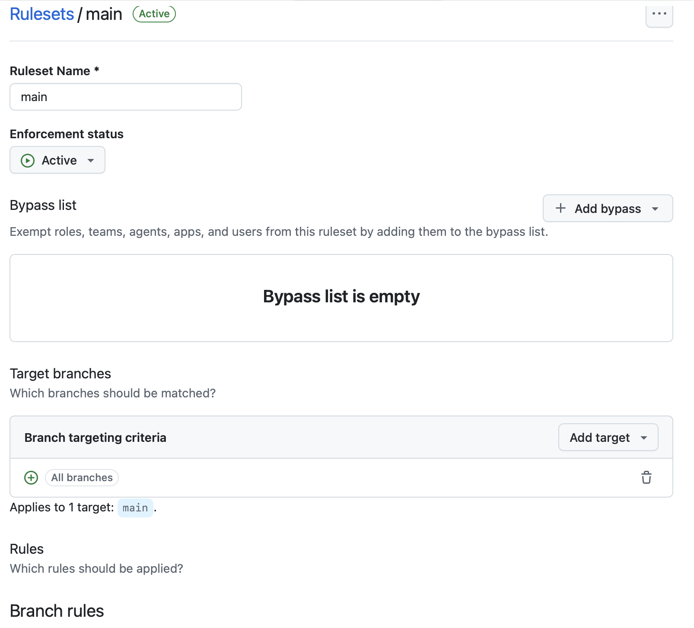
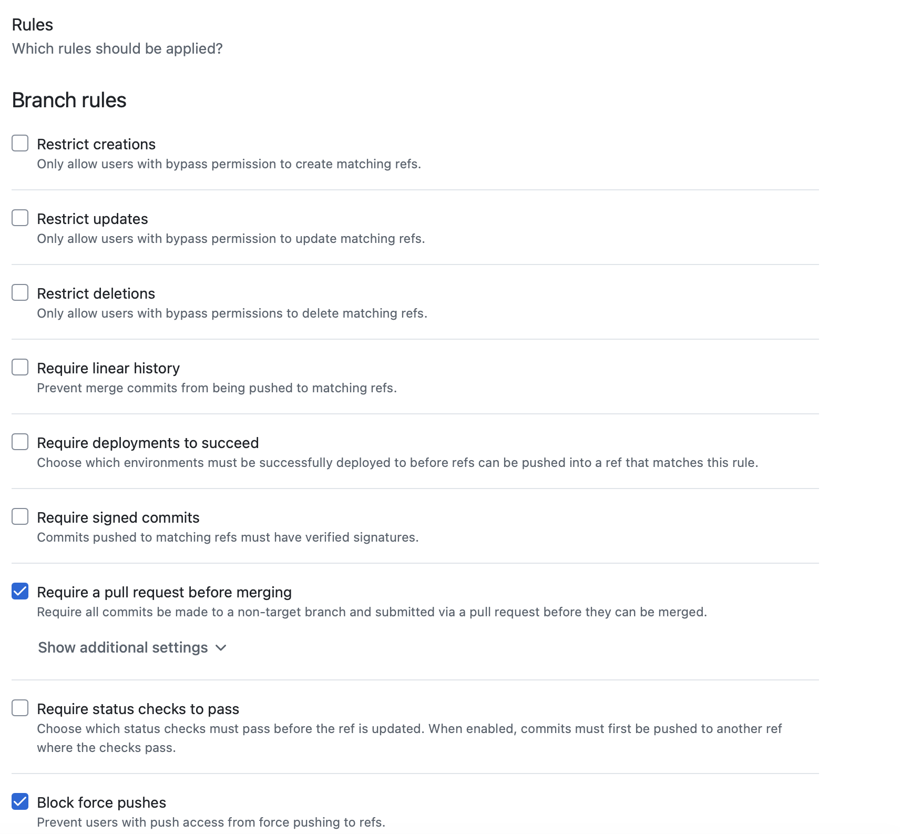
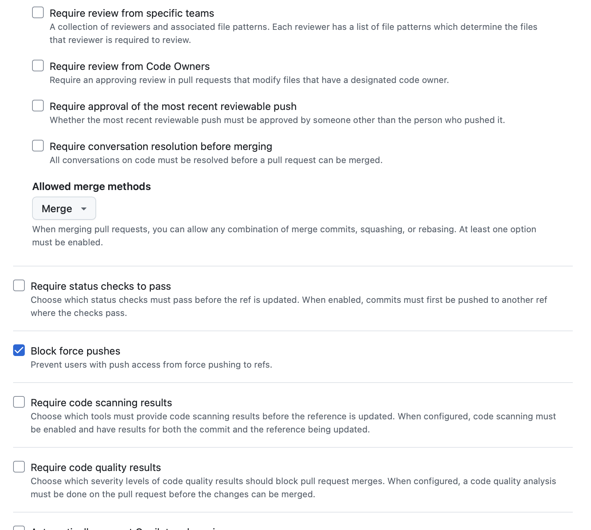
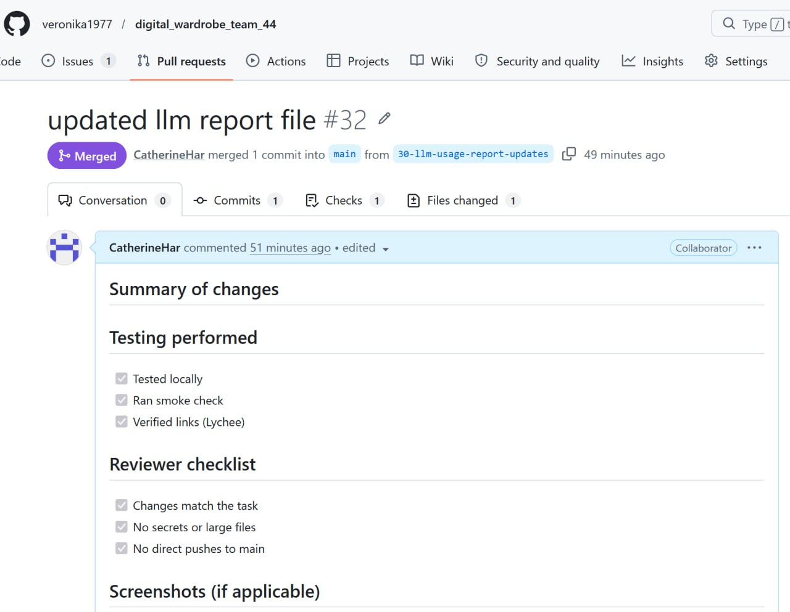
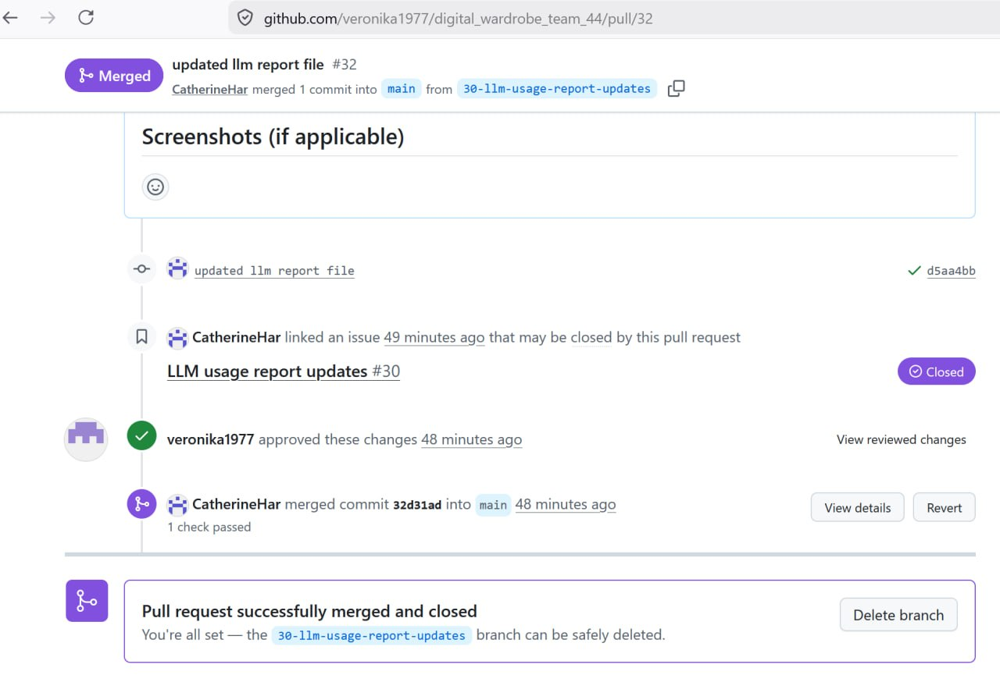
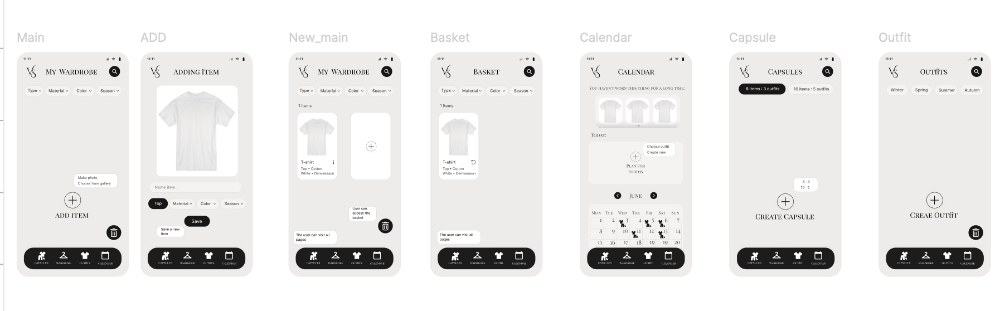

# Digital Wardrobe

Digital wardrobe Telegram Mini App

Digital wardrobe app that helps users organize clothing items, create outfits, capsules and track wear frequency.

## User Stories

All user stories are documented in [user-stories.md](user-stories.md).

### Transcription
The interview's transcription is located in [customer-meeting-transcript.md](customer-meeting-transcript.md).

### Summary

US-01 - Telegram Authentication - Must Have - Active  
US-02 - Add Clothing Item with Photo - Must Have - Active   
US-08 - Automatic Background Removal - Must Have - Active  
US-04 - Tags for Clothing Items - Should Have - Active  
US-05 - Capsule Wardrobes - Should Have - Active  
US-06 - Edit Clothing Item - Should Have - Active   
US-07 -  AI Material Detection - Could Have - Active   
US-10 - Share Outfit by Link - Could Have - Active  
US-03 - AI Outfit Generation - Won't Have - Removed  
US-09  - Social Network - Won't Have - Removed  

**Initial proposed MVP v1 scope:** US-01, US-02, US-08

## Product Interface (Prototype)

**Tool:** Figma  
**Type:** Interactive prototype (Telegram Mini App)

- [Figma Prototype](https://www.figma.com/proto/ZebtG7N3wFGWCVGGdLh6my/Untitled?node-id=2-14&p=f&t=H7sWLnPru4sqBrIr-1&scaling=min-zoom&content-scaling=fixed&page-id=0%3A1)

### Screens included:
- Main screen with empty wardrobe
- Screen with the process of adding item
- Screen with added item
- All additional pages: basket, calendar, outfits, capsuleas

### Covered user stories:
- US-01 - the user immediately gets into the application
- US-02 - the prototype partially shows the adition of a new item 
- US-04 - the user can choose category, season of a new clothes
- US-05 - there is page with capsules

## MVP v0

No local setup is required  
- [MVP v0 Report](mvp-v0-report.md)
- [Deployed URL](https://agent-6a29aac2b0946--benevolent-frangollo-a08785.netlify.app)
-[Link on Telegram app](https://t.me/digital_wardrobe_app_bot/digital_wardrobe_app)
- [Video Demonstration](https://drive.google.com/drive/folders/1q9JeW3Yv7yADk_KCXJ51OTBXAKSWv8RX?usp=drive_link)


## Local Setup

### Prerequisites
- Node.js 18+
- npm or bun

### Clone and run the frontend

```bash
# Clone the frontend repository
git clone https://github.com/veronika1977/digital_wardrobe_777.git
cd digital_wardrobe_777

# Install dependencies

npm install

# Start development server

npm run dev
```
The frontend of app  will be available at http://localhost:5173

## 📊 Requirements Coverage Analysis

### 1. Graphical Interface Prototype Coverage
Our interactive Figma prototype maps out the visual user journeys, layout transitions, and interface components representing the following stable user-story IDs:
* **US-01 (Telegram Authentication):** Covered via the application's instant entry screen flow, demonstrating how a user accesses the main digital wardrobe canvas seamlessly without encountering traditional manual credential gates.
* **US-02 & US-04 (Add Clothing Item & Tags):** Fully represented through the interactive "Add Item" modal window flow. This sequence showcases functional layout placeholders for clothing photo containers, category option dropdowns, and target season check-boxes.
* **US-05 (Capsule Wardrobes):** Visualized within the primary application navigation layout, including the dedicated grid design for compiled capsule management cards and core auxiliary views (wardrobe grid, calendar tracker, and active outfit builders).

### 2. Deployed MVP v0 Foundation Coverage
The runnable technical product baseline establishes early structural and routing dependencies across target platforms. While running entirely on volatile client-side states without persistent cloud-hosted database logic, it establishes the core technical foundations for the following requirements:
* **US-01 (Telegram Authentication Framework):** Successfully covered through baseline platform integration constraints. The frontend application layer reads initial session parameters cleanly and boots directly inside the native Telegram Webview runtime container.
* **US-02 (Add Clothing Item with Photo):** Covered through mock interface data-flows. The executable frontend handles local device file upload prompts and allows users to trigger client-side state changes, dynamically updating the volatile layout repository to append or remove item cards on the dashboard.
* **US-08 (Automatic Background Removal):** Addressed at the infrastructure layout level. The interface provisions the structural buttons and processing states for the upcoming AI segmentation pipeline, though the actual computer vision backend contract will be integrated during the MVP v1 development phase.

*The full technical deployment specifications, architectural limitations, and comprehensive verification procedures are documented in our [MVP v0 Report](mvp-v0-report.md), which serves as the primary reference for executing our repeatable smoke-check scenarios.*

## Links

* **Root Project License (MIT):** [https://github.com/veronika1977/digital_wardrobe_team_44/blob/77da6283661caf30acd9833697de821359a5695e/LICENSE](https://github.com/veronika1977/digital_wardrobe_team_44/blob/77da6283661caf30acd9833697de821359a5695e/LICENSE)
* **Week 2 Report Index (README):** [https://github.com/veronika1977/digital_wardrobe_team_44/blob/77da6283661caf30acd9833697de821359a5695e/reports/week2/README.md](https://github.com/veronika1977/digital_wardrobe_team_44/blob/77da6283661caf30acd9833697de821359a5695e/reports/week2/README.md)
* **Protected Repository Tree State:** [https://github.com/veronika1977/digital_wardrobe_team_44/tree/77da6283661caf30acd9833697de821359a5695e](https://github.com/veronika1977/digital_wardrobe_team_44/tree/77da6283661caf30acd9833697de821359a5695e)
* **User Stories Document:** [https://github.com/veronika1977/digital_wardrobe_team_44/blob/77da6283661caf30acd9833697de821359a5695e/reports/week2/user-stories.md](https://github.com/veronika1977/digital_wardrobe_team_44/blob/77da6283661caf30acd9833697de821359a5695e/reports/week2/user-stories.md)
* **MVP v0 Evaluation Report:** [https://github.com/veronika1977/digital_wardrobe_team_44/blob/77da6283661caf30acd9833697de821359a5695e/reports/week2/mvp-v0-report.md](https://github.com/veronika1977/digital_wardrobe_team_44/blob/77da6283661caf30acd9833697de821359a5695e/reports/week2/mvp-v0-report.md)
* **Customer Meeting Summary:** [https://github.com/veronika1977/digital_wardrobe_team_44/blob/a1afcc298aa855792d4a088d177e2995be2d6f65/reports/week2/customer-meeting-summary.md](https://github.com/veronika1977/digital_wardrobe_team_44/blob/a1afcc298aa855792d4a088d177e2995be2d6f65/reports/week2/customer-meeting-summary.md)
* **Customer Meeting Validation Report (Transcript):** [https://github.com/veronika1977/digital_wardrobe_team_44/blob/47dd0144b8a6b3c91b0fb06e010eeaf57bc2a479/reports/week2/customer-meeting-transcript.md](https://github.com/veronika1977/digital_wardrobe_team_44/blob/47dd0144b8a6b3c91b0fb06e010eeaf57bc2a479/reports/week2/customer-meeting-transcript.md)
* **Weekly Analysis Report:** [https://github.com/veronika1977/digital_wardrobe_team_44/blob/a1afcc298aa855792d4a088d177e2995be2d6f65/reports/week2/analysis.md](https://github.com/veronika1977/digital_wardrobe_team_44/blob/a1afcc298aa855792d4a088d177e2995be2d6f65/reports/week2/analysis.md)
* **LLM Usage Log Report:** [https://github.com/veronika1977/digital_wardrobe_team_44/blob/main/reports/week2/llm-report.md](https://github.com/veronika1977/digital_wardrobe_team_44/blob/main/reports/week2/llm-report.md)
* **Minimal Pull Request Template:** [https://github.com/veronika1977/digital_wardrobe_team_44/blob/main/.github/pull_request_template.md](https://github.com/veronika1977/digital_wardrobe_team_44/blob/main/.github/pull_request_template.md)
* **Sample Reviewed Peer Pull Request:** [https://github.com/veronika1977/digital_wardrobe_team_44/pull/24](https://github.com/veronika1977/digital_wardrobe_team_44/pull/24)
* **Lychee Link Checker Workflow Config:** [https://github.com/veronika1977/digital_wardrobe_team_44/blob/77da6283661caf30acd9833697de821359a5695e/.github/workflows/lychee.yml](https://github.com/veronika1977/digital_wardrobe_team_44/blob/77da6283661caf30acd9833697de821359a5695e/.github/workflows/lychee.yml)
* **Lychee Automated CI Execution Dashboard:** [https://github.com/veronika1977/digital_wardrobe_team_44/actions/workflows/lychee.yml](https://github.com/veronika1977/digital_wardrobe_team_44/actions/workflows/lychee.yml)

---

### External Production & Validation Artifacts
* **Interactive UI/UX Figma Prototype:** [https://www.figma.com/proto/ZebtG7N3wFGWCVGGdLh6my/Untitled?node-id=2-14&p=f&t=H7sWLnPru4sqBrIr-1&scaling=min-zoom&content-scaling=fixed&page-id=0%3A1](https://www.figma.com/proto/ZebtG7N3wFGWCVGGdLh6my/Untitled?node-id=2-14&p=f&t=H7sWLnPru4sqBrIr-1&scaling=min-zoom&content-scaling=fixed&page-id=0%3A1)
* **Live Web Standalone Deployment (Netlify Build):** [https://agent-6a29aac2b0946--benevolent-frangollo-a08785.netlify.app](https://agent-6a29aac2b0946--benevolent-frangollo-a08785.netlify.app)
* **Live Telegram Platform Mini App Gateway:** [https://t.me/digital_wardrobe_app_bot/digital_wardrobe_app](https://t.me/digital_wardrobe_app_bot/digital_wardrobe_app)
* **MVP v0 Runnable Infrastructure Setup Video Walkthrough:** [https://drive.google.com/drive/folders/1q9JeW3Yv7yADk_KCXJ51OTBXAKSWv8RX?usp=drive_link](https://drive.google.com/drive/folders/1q9JeW3Yv7yADk_KCXJ51OTBXAKSWv8RX?usp=drive_link)
* **Customer Validation Interview — Raw Recording (Instructor-Only Protected Access):** [https://drive.google.com/drive/folders/17ulKpKErXnct-yjL5DW251f-OKr4OEoL?usp=sharing](https://drive.google.com/drive/folders/17ulKpKErXnct-yjL5DW251f-OKr4OEoL?usp=sharing)

## License

This project is licensed under the [MIT License](LICENSE)

## Lychee Link Checker

- **CI Configuration:** [.github/workflows/lychee.yml](../../.github/workflows/lychee.yml)
- **Latest successful run:** [GitHub Actions](https://github.com/veronika1977/digital_wardrobe_team_44/actions/workflows/lychee.yml)

### Excluded Links and Justification  

`http://localhost:5173` - Local development server; not accessible from GitHub   
`https://www.linkedin.com/*` - Requires authentication; blocks automated checkersManual check passed  
`https://github.com/veronika1977/digital_wardrobe_team_44/.*`- Internal repository links  

## Screenshots

### Branch Protection Settings




### Example Reviewed PR



### Prototype

