# Week 3 Report: Digital Wardrobe

This document serves as the public index for the Assignment 3 submission.

## Project Information

- **Project Name:** Digital Wardrobe
- **Team Number:** 44
- **Repository:** [digital_wardrobe_team_44](https://github.com/veronika1977/digital_wardrobe_team_44)
- **License:** [LICENSE](../../LICENSE)

**Description:**  
Digital Wardrobe is a Telegram Mini App that helps users manage their clothing items. Users can log in via Telegram, add items with photos, categorize them by material/season/colors, and organize their wardrobe efficiently. The app uses Telegram's native authentication for seamless onboarding.

## Customer Feedback from Assignment 2

During Assignment 2 review, the customer requested:
1. **Design revisions** — addressed via UI Kit (PBI #98)
2. **Weather integration** — added as US-12, planned for MVP v2

## Key Links

- [Historical User Stories (Assignment 2)](../week2/user-stories.md)
- [Current User Stories Index](../../docs/user-stories.md)
- [Product Backlog Board](https://github.com/users/veronika1977/projects/1/views/2)
- [Sprint 1 Backlog Board](https://github.com/users/veronika1977/projects/1/views/6)
- [Sprint 1 Milestone](https://github.com/veronika1977/digital_wardrobe_team_44/milestone/1)
- [MVP v1 Scope View](https://github.com/users/veronika1977/projects/1/views/7)
- [SemVer Release](https://github.com/veronika1977/digital_wardrobe_team_44/releases/tag/v1.0.0)
- [CHANGELOG](../../CHANGELOG.md)
- [Process Requirements](../../Process_Requirements.md)

- **Access/Run Instructions:** [README.md](../../README.md)
- [Roadmap](../../docs/roadmap.md)
- [Definition of Done](../../docs/definition-of-done.md)

## Week 3 Reports

- [**Customer Review Summary**](customer-review-summary.md)
- [**Customer Review Transcript**](customer-review-transcript.md)
- [**Week 3 Reflection**](reflection.md)
- [**Sprint Retrospective**](retrospective.md)
- [**LLM Usage Report**](llm-report.md)

## Story Points

- **Total Product Backlog size:** 63 SP
- **Total Sprint 1 size:** 34 SP

## Sprint Goal

Enable users to securely log in via Telegram and manage their clothing items (add with photo upload or files upload, name, material, season, colors, and delete). The MVP v1 focuses on core wardrobe CRUD operations with Telegram authentication as the entry point.

## MVP v1 Scope

MVP v1 includes the core Telegram authentication flow, the ability to add new clothing items with photo uploads, basic tagging for organization, and soft-delete functionality. It establishes the foundational CRUD operations and UI kit for the Digital Wardrobe Mini App.

## Next Steps

In Sprint 2, we will focus on advanced organization features: automatic AI background removal for uploaded photos, capsule wardrobe grouping, and weather integration. We will also continue improving the frontend UI based on customer feedback.

### User Stories

- **US-01: Telegram Authentication** — [#84](https://github.com/veronika1977/digital_wardrobe_team_44/issues/84)
- **US-02: Add Clothing Item with Photo** — [#85](https://github.com/veronika1977/digital_wardrobe_team_44/issues/85)
- **US-04: Tags for Clothing Items** — [#87](https://github.com/veronika1977/digital_wardrobe_team_44/issues/87)
- **US-11: Delete Item (Soft Delete)** — [#77](https://github.com/veronika1977/digital_wardrobe_team_44/issues/77)

### Supporting Technical PBIs

- Setup Telegram Bot API [#94](https://github.com/veronika1977/digital_wardrobe_team_44/issues/94#issue-4683945852)
- Create Telegram Bot with /start Command [#95](https://github.com/veronika1977/digital_wardrobe_team_44/issues/95#issue-4683990483)
- Research AI background removal API [#96](https://github.com/veronika1977/digital_wardrobe_team_44/issues/96#issue-4684079479)
- API Documentation [#97](https://github.com/veronika1977/digital_wardrobe_team_44/issues/97#issue-4684106195)
- Create UI Kit and Design System [#98](https://github.com/veronika1977/digital_wardrobe_team_44/issues/98#issue-4684187410)

### Task Decomposition

Each User Story has been decomposed into smaller technical PBIs for implementation:

- **US-01** in 3 subtasks (Backend Auth, Frontend SDK, Auth State)
- **US-02** in 3 subtasks (Backend API, Frontend Form, Photo Upload)
- **US-04** in 2 subtasks (Backend Tags, Frontend Tags UI)
- **US-11** in 2 subtasks (Backend Delete, Frontend Delete Button)

## PBI Types, Statuses & Priorities

Following the shared Process Requirements:
- **PBI Types:** User Story, Technical PBI, Course Task, Bug Report
- **Work Status:** To Do, Ready, In Progress, Review, Done
- **MoSCoW Priority:** Must Have, Should Have, Could Have, Won't Have
- **MVP Version Tracking:** Custom field in GitHub Projects (MVP v1, MVP v2, Future)
- **Sprint Milestone:** Used as the authoritative container for Sprint-selected PBIs

## Roadmap

- **Current Sprint (Sprint 1):** MVP v1 — Core wardrobe CRUD with Telegram auth
- **Next Sprint (Sprint 2):** MVP v2 — Weather integration, AI background removal, capsule wardrobes

[Full roadmap](../../docs/roadmap.md)

### Reviewed Issue-Linked PRs

- [PR: Backend Telegram Auth Endpoint](https://github.com/Mrxfg/digital-wardrobe/pull/13#issue-4700574010)
- [PR: Photo Upload Mechanism](https://github.com/Mrxfg/digital-wardrobe/pull/17#issue-4702207955)
- [PR: Frontend Telegram SDK Integration](https://github.com/veronika1977/digital_wardrobe_777/pull/12)
- [PR: Frontend Add Item](https://github.com/veronika1977/digital_wardrobe_777/pull/4)

### Issue & PR Templates

- [User Story Template](../../.github/ISSUE_TEMPLATE/user-story.md)
- [Other PBI Template](../../.github/ISSUE_TEMPLATE/pbi.md)
- [Course Task Template](../../.github/ISSUE_TEMPLATE/course-task.md)
- [Bug Report Template](../../.github/ISSUE_TEMPLATE/bug-report.md)
- [Extended PR Template](../../.github/pull_request_template.md)

## Verification Evidence

All MVP v1 PBIs will be verified against their Acceptance Criteria:
- [US-01 verification](https://github.com/veronika1977/digital_wardrobe_team_44/pull/153#issuecomment-4757708206)
- [US-02 verification](https://github.com/veronika1977/digital_wardrobe_team_44/pull/144#issue-4703087310)
- [US-04 verification](https://github.com/veronika1977/digital_wardrobe_team_44/pull/143#issue-4703045662)
- [US-11 verification](https://github.com/veronika1977/digital_wardrobe_team_44/pull/142#issue-4702243424)

## Delivered MVP v1

- [**Telegram Bot**](https://t.me/digital_wardrobe_app_bot/digital_wardrobe_app)
- [**Full Setup Guide**](../../README.md)

## Video Demonstration
[**Link**](https://drive.google.com/drive/folders/1U6ZyvhWXD34KY7kA_3uiMyZwmU-Z02DT?usp=sharing)

## Contribution Traceability Table

| Team Member | Issues Created | PRs Created | PRs Reviewed | Meaningful Comments |
| :--- | :--- | :--- | :--- | :--- |
| Veronika Drozd (@veronika1977) | [#77](https://github.com/veronika1977/digital_wardrobe_team_44/issues/77#issue-4674006802), [#85](https://github.com/veronika1977/digital_wardrobe_team_44/issues/85#issue-4678164428), [#87](https://github.com/veronika1977/digital_wardrobe_team_44/issues/87#issue-4678207198),[#103](https://github.com/veronika1977/digital_wardrobe_team_44/issues/103#issue-4685452047), [#104](https://github.com/veronika1977/digital_wardrobe_team_44/issues/104#issue-4685486734),[#106](https://github.com/veronika1977/digital_wardrobe_team_44/issues/106#issue-4685580014), [#107](https://github.com/veronika1977/digital_wardrobe_team_44/issues/107#issue-4685646081), [#108](https://github.com/veronika1977/digital_wardrobe_team_44/issues/108#issue-4685679546),[#109](https://github.com/veronika1977/digital_wardrobe_team_44/issues/109#issue-4685715427), [#110](https://github.com/veronika1977/digital_wardrobe_team_44/issues/110#issue-4685765359), [#111](https://github.com/veronika1977/digital_wardrobe_team_44/issues/111#issue-4685918887), [#112](https://github.com/veronika1977/digital_wardrobe_team_44/issues/112#issue-4685953051) | [#78](https://github.com/veronika1977/digital_wardrobe_team_44/pull/78#issue-4674106568),[#92](https://github.com/veronika1977/digital_wardrobe_team_44/pull/92#issue-4678334304) [#93](https://github.com/veronika1977/digital_wardrobe_team_44/pull/93#issue-4678407380), [#125](https://github.com/veronika1977/digital_wardrobe_team_44/pull/125#issue-4694064176), [#132](https://github.com/veronika1977/digital_wardrobe_team_44/pull/132#issue-4699172212), [#143](https://github.com/veronika1977/digital_wardrobe_team_44/pull/143#issue-4703045662) | [#118](https://github.com/veronika1977/digital_wardrobe_team_44/pull/118#issue-4691426934), [#120](https://github.com/veronika1977/digital_wardrobe_team_44/pull/120#issue-4691612725), [#122](https://github.com/veronika1977/digital_wardrobe_team_44/pull/122#issue-4691826053), [#128](https://github.com/veronika1977/digital_wardrobe_team_44/pull/128#issue-4698428149), [#135](https://github.com/veronika1977/digital_wardrobe_team_44/pull/135#issue-4699820761), [#136](https://github.com/veronika1977/digital_wardrobe_team_44/pull/136#issue-4699903881) | [#118](https://github.com/veronika1977/digital_wardrobe_team_44/pull/118#pullrequestreview-4523979310), [#120](https://github.com/veronika1977/digital_wardrobe_team_44/pull/120#pullrequestreview-4524156540),  [#125](https://github.com/veronika1977/digital_wardrobe_team_44/pull/128#pullrequestreview-4530556006) [#122](https://github.com/veronika1977/digital_wardrobe_team_44/pull/122#pullrequestreview-4524370717), [#128](https://github.com/veronika1977/digital_wardrobe_team_44/pull/128#issue-4698428149)|
| Evgeni1a (@Evgeni1a) | [#94](https://github.com/veronika1977/digital_wardrobe_team_44/issues/94#issue-4683945852), [#95](https://github.com/veronika1977/digital_wardrobe_team_44/issues/95#issue-4683990483), [#96](https://github.com/veronika1977/digital_wardrobe_team_44/issues/96#issue-4684079479), [#97](https://github.com/veronika1977/digital_wardrobe_team_44/issues/97#issue-4684106195), [#98](https://github.com/veronika1977/digital_wardrobe_team_44/issues/98#issue-4684187410),[#119](https://github.com/veronika1977/digital_wardrobe_team_44/issues/119#issue-4691592395), [#121](https://github.com/veronika1977/digital_wardrobe_team_44/issues/121#issue-4691823866) | [#120](https://github.com/veronika1977/digital_wardrobe_team_44/pull/120#issue-4691612725), [#122](https://github.com/veronika1977/digital_wardrobe_team_44/pull/122#issue-4691826053), [#135](https://github.com/veronika1977/digital_wardrobe_team_44/pull/135#issue-4699820761), [#136](https://github.com/veronika1977/digital_wardrobe_team_44/pull/136#issue-4699903881) | [#125](https://github.com/veronika1977/digital_wardrobe_team_44/pull/125#issue-4694064176), [#132](https://github.com/veronika1977/digital_wardrobe_team_44/pull/132#issue-4699172212), [#134](https://github.com/veronika1977/digital_wardrobe_team_44/pull/134#issue-4699301927) | [#125](https://github.com/veronika1977/digital_wardrobe_team_44/pull/125#pullrequestreview-4526675157), [#130](https://github.com/veronika1977/digital_wardrobe_team_44/pull/130#pullrequestreview-4530893575), [#132](https://github.com/veronika1977/digital_wardrobe_team_44/pull/132#pullrequestreview-4531324793), [#134](https://github.com/veronika1977/digital_wardrobe_team_44/pull/134#pullrequestreview-4531482118)|
| Catherine Har (@CatherineHar) | [#117](https://github.com/veronika1977/digital_wardrobe_team_44/issues/117#issue-4690961343) | [#118](https://github.com/veronika1977/digital_wardrobe_team_44/pull/118#issue-4691426934) | [#78](https://github.com/veronika1977/digital_wardrobe_team_44/pull/78#issue-4674106568), [#92](https://github.com/veronika1977/digital_wardrobe_team_44/pull/92#issue-4678334304), [#93](https://github.com/veronika1977/digital_wardrobe_team_44/pull/93#issue-4678407380), [#143](https://github.com/veronika1977/digital_wardrobe_team_44/pull/143#issue-4703045662) | [#93](https://github.com/veronika1977/digital_wardrobe_team_44/pull/93#pullrequestreview-4510806710), [#143](https://github.com/veronika1977/digital_wardrobe_team_44/pull/143#pullrequestreview-4534897734) |
| Darina Luch (@DarinaLuch) | [#129](https://github.com/veronika1977/digital_wardrobe_team_44/issues/129#issue-4698734905) | [#128](https://github.com/veronika1977/digital_wardrobe_team_44/pull/128#issue-4698428149),[#130](https://github.com/veronika1977/digital_wardrobe_team_44/pull/130#issue-4698758725) | [#148](https://github.com/veronika1977/digital_wardrobe_team_44/pull/148#issue-4705687160) | [#148](https://github.com/veronika1977/digital_wardrobe_team_44/pull/148#pullrequestreview-4536747445) |
| Mrxfg (@Mrxfg) | [#133](https://github.com/veronika1977/digital_wardrobe_team_44/issues/133#issue-4699280968) | [#134](https://github.com/veronika1977/digital_wardrobe_team_44/pull/134#issue-4699301927) | [#142](https://github.com/veronika1977/digital_wardrobe_team_44/pull/142#issue-4702243424) | [#142](https://github.com/veronika1977/digital_wardrobe_team_44/pull/142#pullrequestreview-4534257243) |

## Screenshots

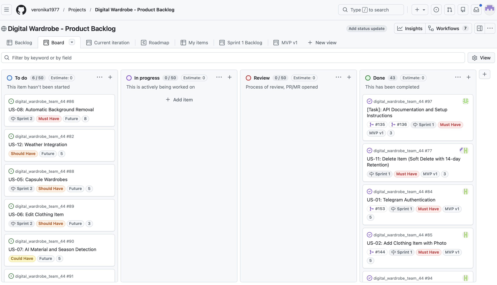
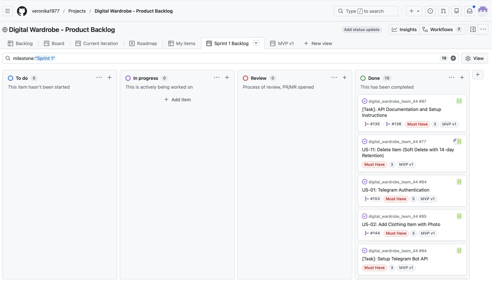
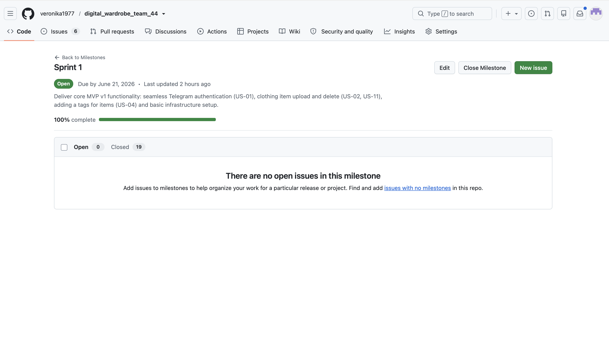
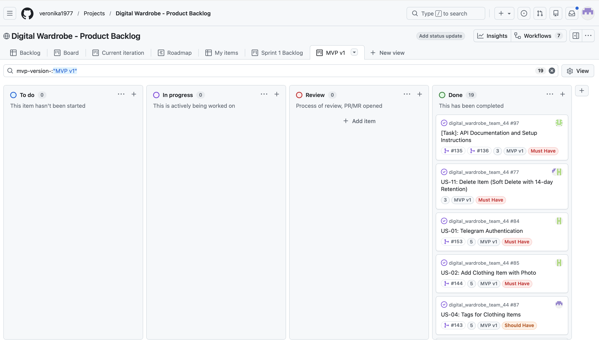
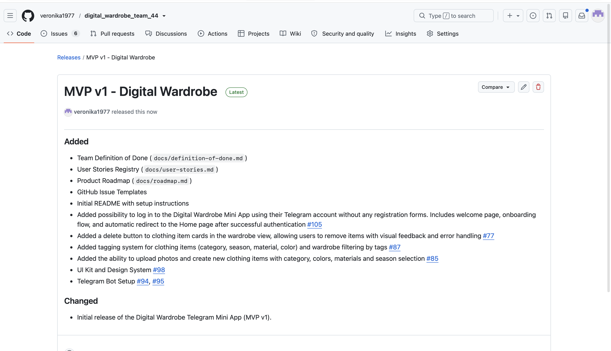
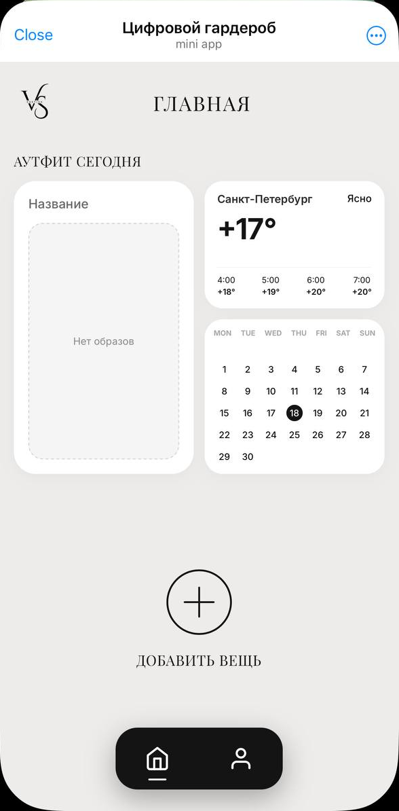
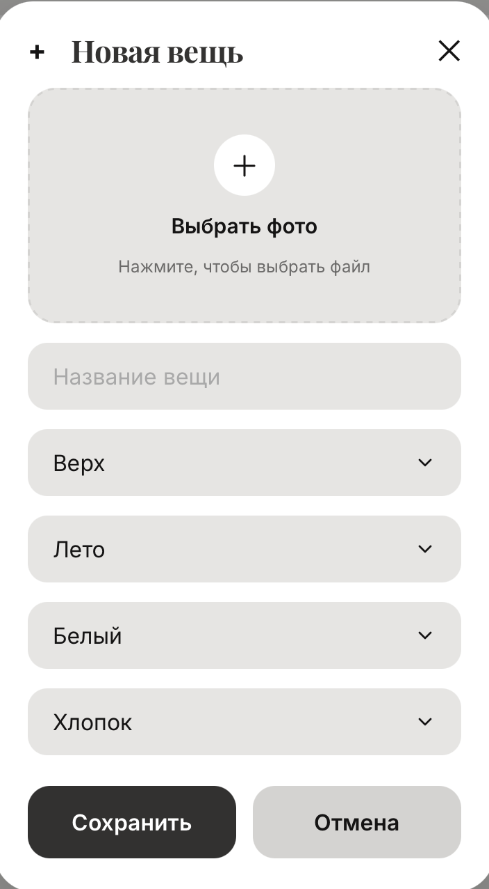
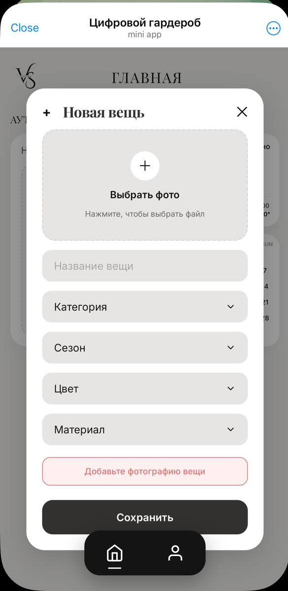
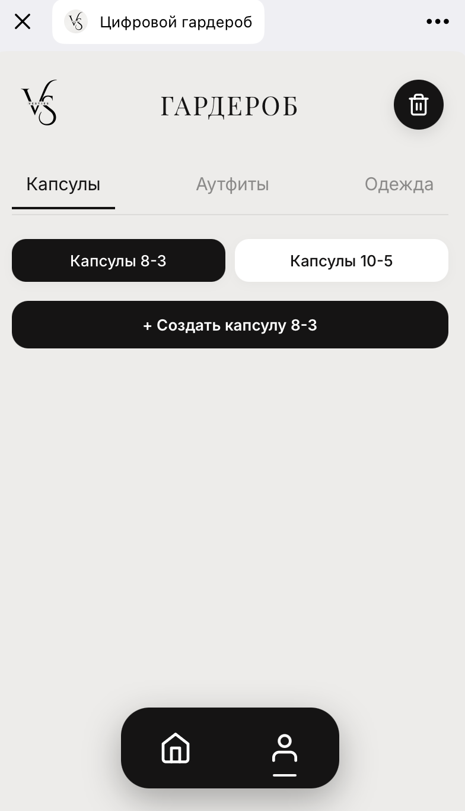
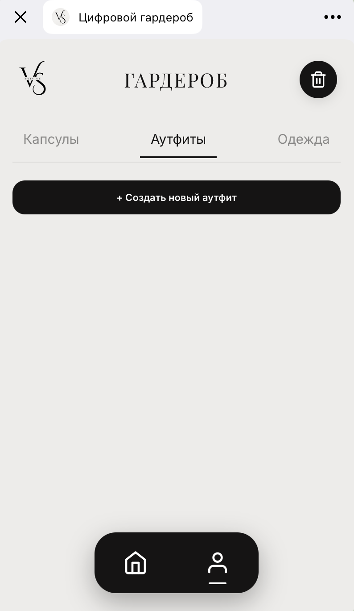
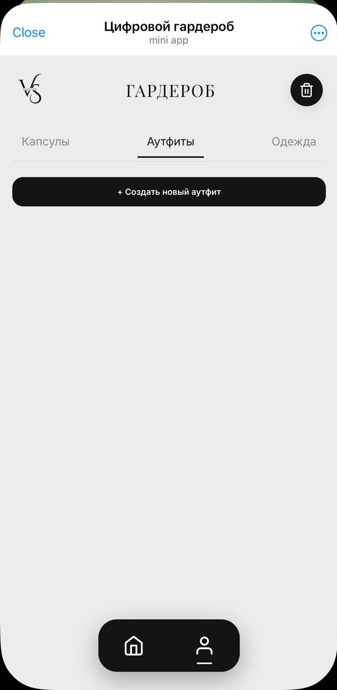
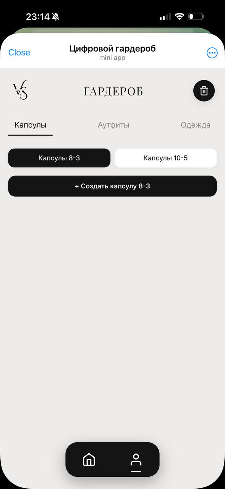
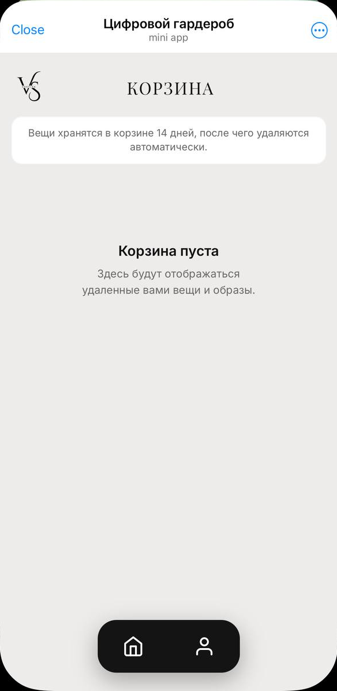
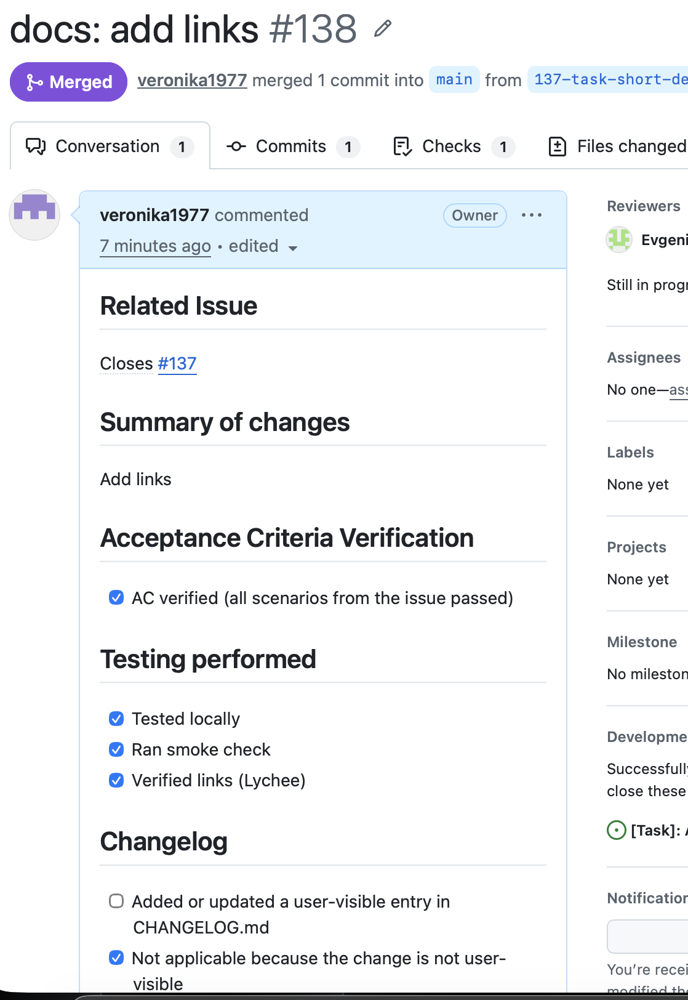
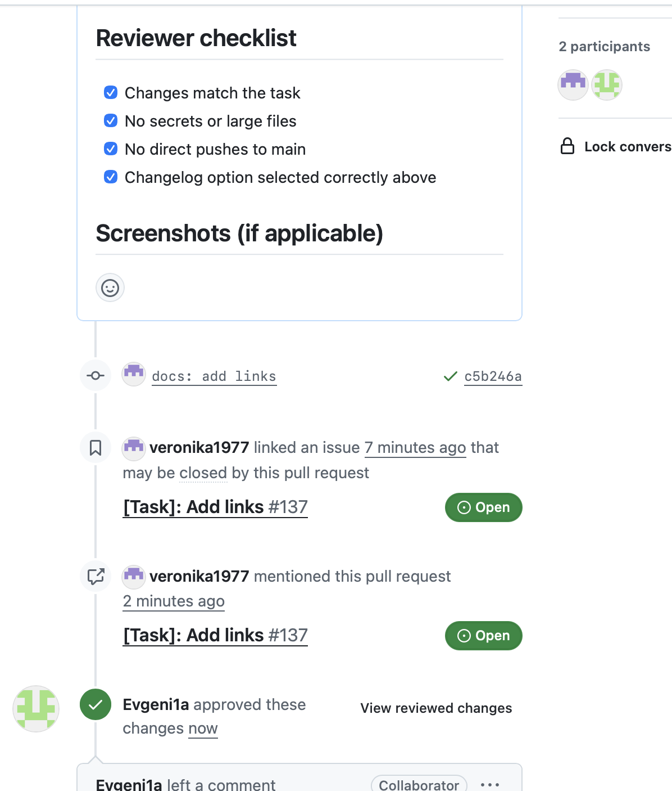
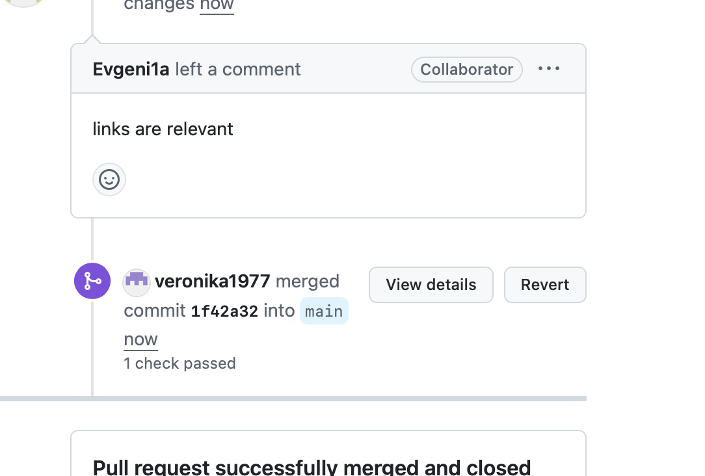