# Week 4 Report: Digital Wardrobe

This document serves as the public index for the Assignment 4 submission.

## Project Information

- **Project Name:** Digital Wardrobe
- **Team Number:** 44
- **Repository:** [digital_wardrobe_team_44](https://github.com/veronika1977/digital_wardrobe_team_44)
- **License:** [LICENSE](../../LICENSE)

### Deployed Product
- **Telegram Mini App:** [Vestis](https://t.me/digital_wardrobe_app_bot)

**Description:**  

Digital Wardrobe is a Telegram Mini App that helps users manage their clothing items. Users can log in via Telegram, add items with photos, categorize them by material/season/colors, and organize their wardrobe efficiently. The app uses Telegram's native authentication for seamless onboarding.

## Repositories

| Repo | Purpose | Link |
|------|---------|------|
| Main | Docs, UAT, reports | [digital_wardrobe_team_44](https://github.com/veronika1977/digital_wardrobe_team_44) |
| Backend | FastAPI + Rembg | [digital-wardrobe](https://github.com/Mrxfg/digital-wardrobe) |
| Frontend | React + Telegram Mini App | [digital_wardrobe_777](https://github.com/veronika1977/digital_wardrobe_777) |

## Customer Feedback Response

The following table summarizes the customer's feedback on MVP v1 and the team's response. 
All feedback points are traced to Product Backlog decisions per Process Requirements.

| Feedback point | Resulting PBI or issue | Status | Response |
|---|---|---|---|
| Customer found "demiseason" season option is confusing and asked to change it on "base". | [#170](https://github.com/veronika1977/digital_wardrobe_team_44/issues/170#issue-4736603463) | Done| Change "demiseason" tag on "base" tag |
| Customer asked to add days remaining counter for items in cart. | [#171](https://github.com/veronika1977/digital_wardrobe_team_44/issues/171#issue-4736685606), [#172](https://github.com/veronika1977/digital_wardrobe_team_44/issues/172#issue-4736712996) | Done | Show "Осталось X дней" on each cart item in the basket page. |

### Feedback from UAT

The following feedback was received during UAT:
- [**PBI #168**](https://github.com/veronika1977/digital_wardrobe_team_44/issues/168) Delete badge
- [**PBI #169**](https://github.com/veronika1977/digital_wardrobe_team_44/issues/169) Restore confirmation
- [**PBI #179**](https://github.com/veronika1977/digital_wardrobe_team_44/issues/179) Color swatch

## Sprint 2 Increment (MVP v2)

This sprint focused on quality gates, CI/CD, and customer validation.

### User Stories Delivered
- US-06: Edit Clothing Item (3 SP)
- US-05: Capsule Wardrobes (8 SP)
- US-08: Automatic Background Removal (15 SP)

### Quality Improvements

- CI/CD pipelines for backend and frontend
- Branch protection rules on all repositories
- Automated QRT tests (QRT-001, QRT-002, QRT-003)
- 66% code coverage (exceeds 30% requirement)
- 64 backend tests + 3 frontend tests passing

**Total Sprint 2 velocity:** 41 SP

**Sprint Goal:** Deliver MVP v2 with quality gates, CI/CD automation, and customer validation  
**Sprint Dates:** June 22 – June 28, 2026  
**Scope:** 3 User Stories (US-05, US-06, US-08) + Quality Gates (QRT-001/002/003) + CI/CD setup

**Quality Requirements:**
- QR-001: API Response Time < 3s — [Verified](https://github.com/Mrxfg/digital-wardrobe/actions/runs/28304967461/job/83859755265)
- QR-002: Fault Tolerance — [Verified](https://github.com/Mrxfg/digital-wardrobe/actions/runs/28304967461/job/83859629619)
- QR-003: Test Coverage ≥30% — [66% achieved](https://github.com/Mrxfg/digital-wardrobe/actions/runs/28304967461/job/83859629619)

## Quality Model (ISO/IEC 25010)

| Characteristic | Sub-characteristic | Why Important | Measured By |
|----------------|-------------------|---------------|-------------|
| Performance Efficiency | Time Behaviour | Fast UX in Telegram | QR-001 (API < 3s) |
| Reliability | Fault Tolerance | No data loss on AI failures | QR-002 (Rembg fallback) |
| Maintainability | Testability | Sustainable development | QR-003 (30% coverage) |

## Quality Gates & CI Status

## Test Links
- **Unit tests (Backend):** [tests/test_items.py](https://github.com/Mrxfg/digital-wardrobe/blob/main/backend/tests/test_items.py)
- **Integration tests (Backend):** [tests/test_background_removal.py](https://github.com/Mrxfg/digital-wardrobe/blob/main/backend/tests/test_background_removal.py)
- **QRT tests (Backend):** [tests/quality/](https://github.com/Mrxfg/digital-wardrobe/tree/main/backend/tests/quality)
- **Unit tests (Frontend):** [src/__tests__/](https://github.com/veronika1977/digital_wardrobe_777/tree/main/src/__tests__)


| Repository | CI Status | Branch Protection | Coverage |
|------------|:---------:|:-----------------:|:--------:|
| Backend | [Passing](https://github.com/Mrxfg/digital-wardrobe/actions/runs/28304967461/job/83859629619) | Configured | 66% |
| Frontend | [Passing](https://github.com/veronika1977/digital_wardrobe_777/actions/runs/28297177214/job/83839064870) |Configured | 100% (wardrobe.ts)  |
| Main (docs) | [Passing](https://github.com/veronika1977/digital_wardrobe_team_44/actions/runs/28306512649) | Configured | - |

## Branch Protection Evidence

All repositories have protected `main` branches with:
- Required PR reviews (1 approval)
- Required status checks (all CI jobs)
- Require branches to be up to date
- Dismiss stale approvals
- No force pushes allowed
- No deletions allowed


### How to Run Locally

```bash
# Backend
cd backend && pip install -r requirements.txt && uvicorn app.main:app --reload

# Frontend
cd frontend && npm install --legacy-peer-deps && npm run dev
```

**Screenshots for backend repository**  
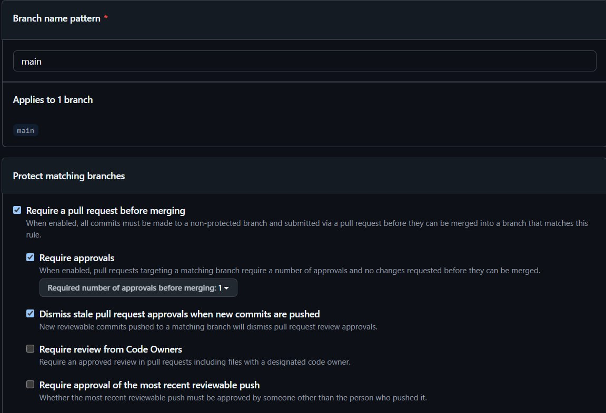
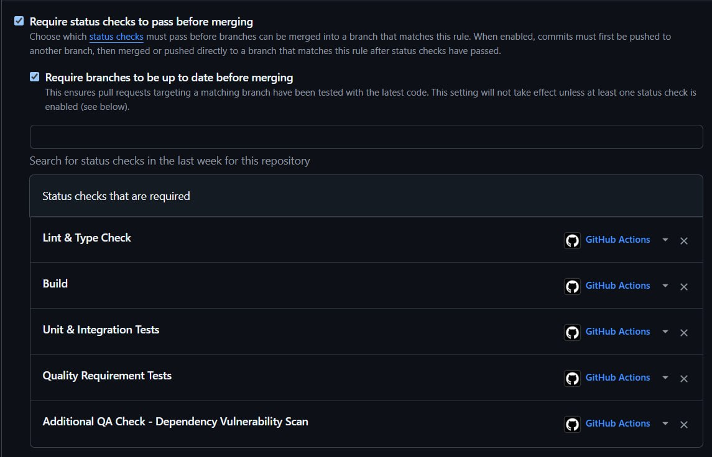
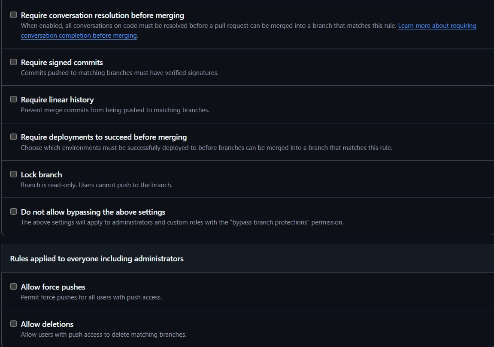

**Screenshots for frontend repository**  

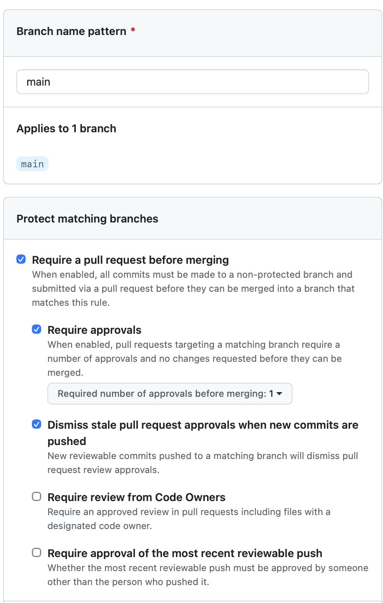
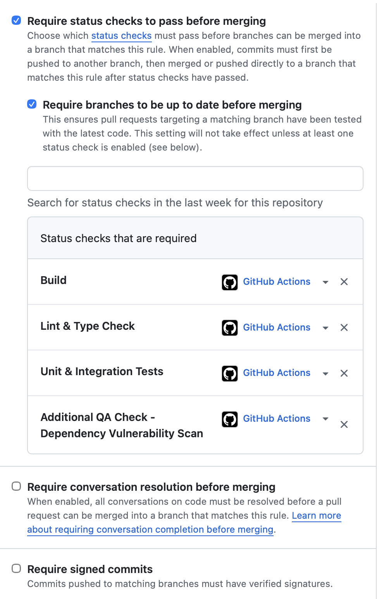
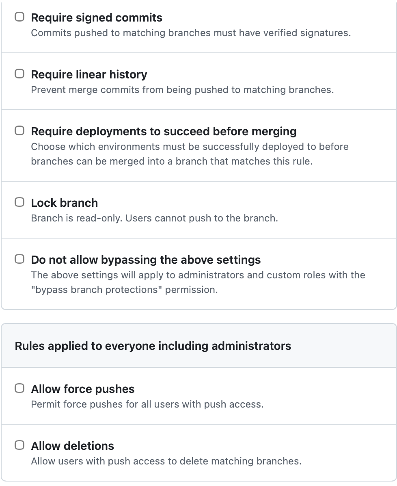

**Screenshots for main repository**  

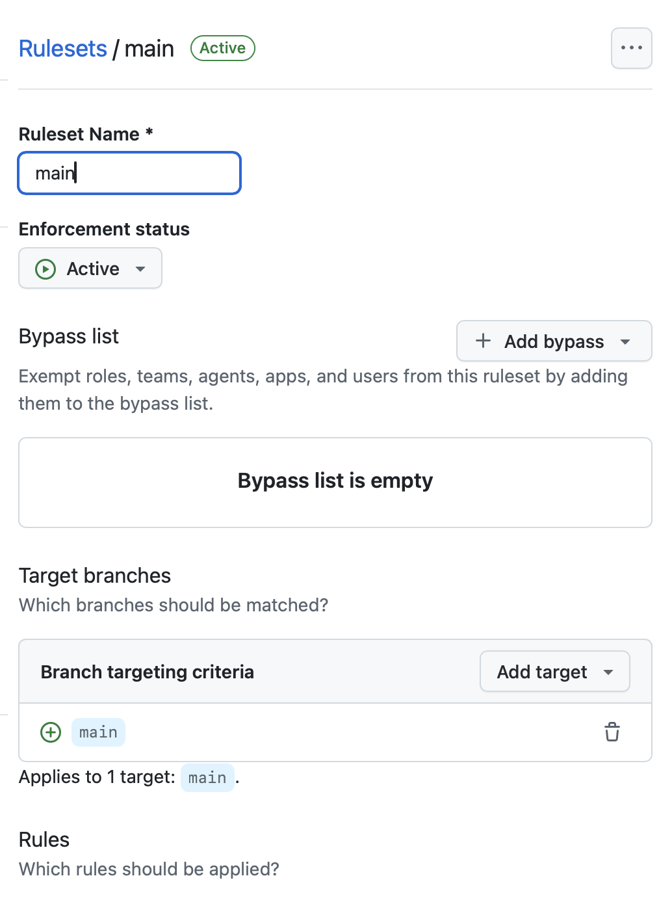
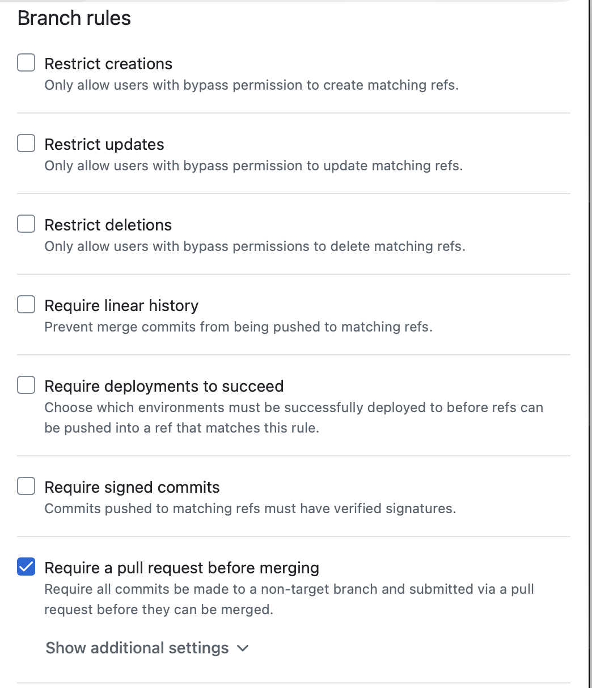
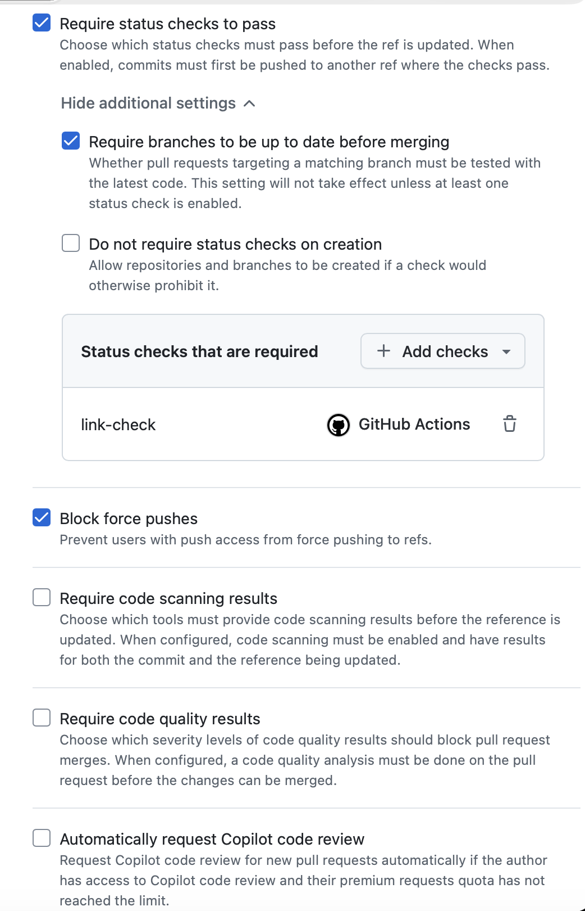

## UAT Results Summary

Customer validation session held on June 25, 2026 with customer.

| UAT ID | Scenario | Result | Key Feedback |
|--------|----------|:------:|--------------|
| UAT-001 | Add Clothing Item | Passed | "Show actual color, not text" |
| UAT-002 | Delete & Cart | Passed | "Delete badge too small; add restore confirmation" |
| UAT-003 | Filter by Season | Passed | "No problems, all good" |

**Result:** 3/3 scenarios passed

**Most important feedback:**

1. Delete badge (✕) too small → explicit "Удалить" button
2. Color text not intuitive → show color swatch
3. Add confirmation dialog for restore from cart

**Resulting PBI:**
- [x] #168: Replace delete badge (3 SP, Must Have)
- [x] #169: Restore confirmation dialog (2 SP, Should Have)
- [x] #179: Color swatch instead of text (3 SP, Should Have)

**Recording:** Submitted privately via Moodle (not in public repo).

Full details: [docs/user-acceptance-tests.md](docs/user-acceptance-tests.md)

## Demo & Presentation

- [Demo Video](https://drive.google.com/drive/folders/11g03djGSts4WhYvRZkQ2ZdtfoOnMf1PW?usp=sharing)
- **Slides:** [Presentation_team_44.pdf](Presentation_team_44.pdf) (also submitted via Moodle)

### Backlog Links
- **Product Backlog:** [GitHub Projects Board](https://github.com/users/veronika1977/projects/1)
- **Sprint 2 Backlog:** [Sprint Board](https://github.com/users/veronika1977/projects/1/views/8)
- **Sprint Milestone:** [Assignment 4 Sprint](https://github.com/veronika1977/digital_wardrobe_team_44/milestone/2)


## Documentation

| Document | Link |
|----------|------|
| Quality Requirements | [docs/quality-requirements.md](docs/quality-requirements.md) |
| Quality Requirement Tests | [docs/quality-requirement-tests.md](docs/quality-requirement-tests.md) |
| User Acceptance Tests | [docs/user-acceptance-tests.md](docs/user-acceptance-tests.md) |
| Testing Status | [docs/testing.md](docs/testing.md) |
| Definition of Done | [docs/definition-of-done.md](docs/definition-of-done.md) |
| Roadmap | [docs/roadmap.md](docs/roadmap.md) |
| Customer Review Transcript | [reports/week4/customer-review-transcript.md](reports/week4/customer-review-transcript.md) | 
|Lychee Exclusions Justification | [docs/lychee-exclusions.md](docs/lychee-exclusions.md) |

## Continuity: How Quality Gates Govern Future Work

The following gates from Assignment 4 will continue to govern all subsequent sprints:

| Gate | Enforcement | Future Impact |
|------|-------------|---------------|
| **Branch Protection** | Required on all repos | Every PR needs 1 review + passing CI |
| **Coverage Threshold** |  ≥30% required per DoD  | Must maintain as code grows |
| **QRT Tests** | Run on every PR | QR-001/002/003 must stay green |
| **DoD Checklist** | Manual PR checklist | Applied to all PRs going forward |
| **Lychee Link Check** | Runs on doc changes | Prevents broken doc links |

**Why this matters:** These gates prevent technical debt accumulation and ensure every increment meets the quality bar established in Sprint 2.

---

## SemVer Release

### Release: [v1.1.0 (MVP v2)](https://github.com/veronika1977/digital_wardrobe_team_44/releases/tag/v1.1.0)

**Version bump rationale:**
- **Minor (1.0.0 → 1.1.0):** New features added (Edit Item, Capsules, Background Removal)
- **Backward compatible:** No breaking changes to existing API
- **Forward compatible:** Sprint 3 will build on this foundation

**Screenshot:**  
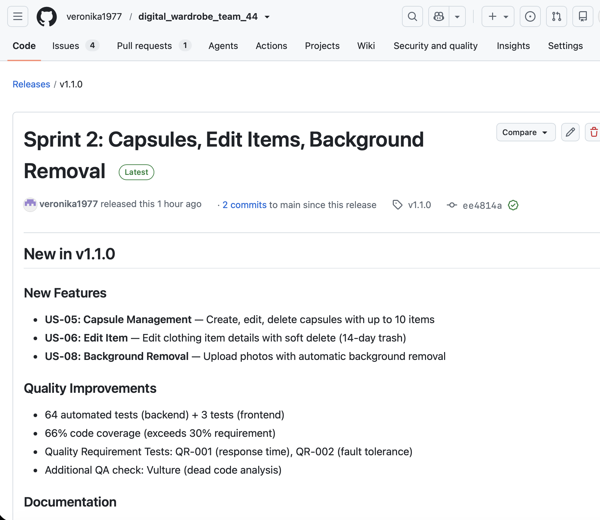

### Changelog
[CHANGELOG.md](../../CHANGELOG.md)

---

## Contribution Summary

This table shows contributions only to the main repository (digital_wardrobe_team_44). However, team members also actively work in two separate repositories (backend and frontend) following the GitHub workflow.

**Sprint 2 Contribution Summary:**
- **@CatherineHar:** Frontend development
- **@Mrxfg:** Backend development
- **@veronika1977:** Tests, GitHub reports for Assignment 4, issues/PBIs creation, presentation support
- **@Evgeni1a:** Customer review transcript and summary
- **@DarinaLuch:** Presentation and LLM report

| Team Member | Role | Issues | PRs | Reviews | Comments |
|-------------|------|:------:|:---:|:-------:|:--------:|
| @veronika1977 | Scrum Master | [#86](https://github.com/veronika1977/digital_wardrobe_team_44/issues/86), [#89](https://github.com/veronika1977/digital_wardrobe_team_44/issues/89), [#180](https://github.com/veronika1977/digital_wardrobe_team_44/issues/180#issue-4741123981), [#202](https://github.com/veronika1977/digital_wardrobe_team_44/issues/202), [#208](https://github.com/veronika1977/digital_wardrobe_team_44/issues/208#issue-4761875818) | [#181](https://github.com/veronika1977/digital_wardrobe_team_44/pull/181#issue-4741144560), [#198](https://github.com/veronika1977/digital_wardrobe_team_44/issues/198#issue-4758796132), [#201](https://github.com/veronika1977/digital_wardrobe_team_44/pull/201#issue-4759043204),[#203](https://github.com/veronika1977/digital_wardrobe_team_44/pull/203) | [#191](https://github.com/veronika1977/digital_wardrobe_team_44/pull/191), [#193](https://github.com/veronika1977/digital_wardrobe_team_44/pull/193),[#199](https://github.com/veronika1977/digital_wardrobe_team_44/pull/199#issue-4758810557) | [Review #122](https://github.com/veronika1977/digital_wardrobe_team_44/pull/122#pullrequestreview-4524370717), [Review #120](https://github.com/veronika1977/digital_wardrobe_team_44/pull/120#pullrequestreview-4524156540) |
| @Evgeni1a | Developer |[#119](https://github.com/veronika1977/digital_wardrobe_team_44/issues/119#issue-4691592395), [#121](https://github.com/veronika1977/digital_wardrobe_team_44/issues/121#issue-4691823866) | [#120](https://github.com/veronika1977/digital_wardrobe_team_44/pull/120#issue-4691612725), [#122](https://github.com/veronika1977/digital_wardrobe_team_44/pull/122#issue-4691826053) | [#181](https://github.com/veronika1977/digital_wardrobe_team_44/pull/181#issue-4741144560) | [Review #181](https://github.com/veronika1977/digital_wardrobe_team_44/pull/181#pullrequestreview-4568345997) |
| @CatherineHar | Developer | [#206](https://github.com/veronika1977/digital_wardrobe_team_44/issues/206#issue-4761828114) | [#207](https://github.com/veronika1977/digital_wardrobe_team_44/pull/207#issue-4761834956) | [#200](https://github.com/veronika1977/digital_wardrobe_team_44/pull/200#issue-4758913009), [#201](https://github.com/veronika1977/digital_wardrobe_team_44/pull/201#issue-4759043204) | [Review #201](https://github.com/veronika1977/digital_wardrobe_team_44/pull/201#pullrequestreview-4585674093) |
| @DarinaLuch | Scrum Owner | [#194](https://github.com/veronika1977/digital_wardrobe_team_44/issues/194#issue-4758600820)| [#195](https://github.com/veronika1977/digital_wardrobe_team_44/pull/195#issue-4758648032) | [#207](https://github.com/veronika1977/digital_wardrobe_team_44/pull/207#issue-4761834956) | [Review #207](https://github.com/veronika1977/digital_wardrobe_team_44/pull/207#pullrequestreview-4587366695) |
| @Mrxfg | Developer | [#204](https://github.com/veronika1977/digital_wardrobe_team_44/issues/204#issue-4760444513) | [#205](https://github.com/veronika1977/digital_wardrobe_team_44/pull/205#issue-4760508929) | [#199](https://github.com/veronika1977/digital_wardrobe_team_44/pull/199#issue-4758810557), [#203](https://github.com/veronika1977/digital_wardrobe_team_44/pull/203) | [Review #199](https://github.com/veronika1977/digital_wardrobe_team_44/pull/199#pullrequestreview-4585574765), [Review #203](https://github.com/veronika1977/digital_wardrobe_team_44/pull/203#pullrequestreview-4586532174) |


## Current Product Status

### Health Metrics
- **Backend:** Deployed, stable, 66% coverage
- **Frontend:** Deployed, stable, 100% coverage (tested modules)
- **CI/CD:** All 3 pipelines green
- **Quality Gates:** 3/3 QRT passing
- **Customer Validation:** 3/3 UAT passed
- **Known Limitations:**
  - Rembg CPU-only (slower on large images)
  - Telegram works only with VPN or proxy

---

## Next Steps (Sprint 3)

For the next sprint, we want to close other user stories, get feedback from the customer, and create and solve PBIs. Moreover, it will be good if we improve backend quality.

---

## Report Files

- [Customer Review Summary](customer-review-summary.md)
- [Customer Review Transcript](customer-review-transcript.md)
- [Reflection](reflection.md)
- [Retrospective](retrospective.md)
- [LLM Report](llm-report.md)
- [Presentation](Presentation_team_44.pdf)
## Evidence Screenshots

### Sprint Milestone
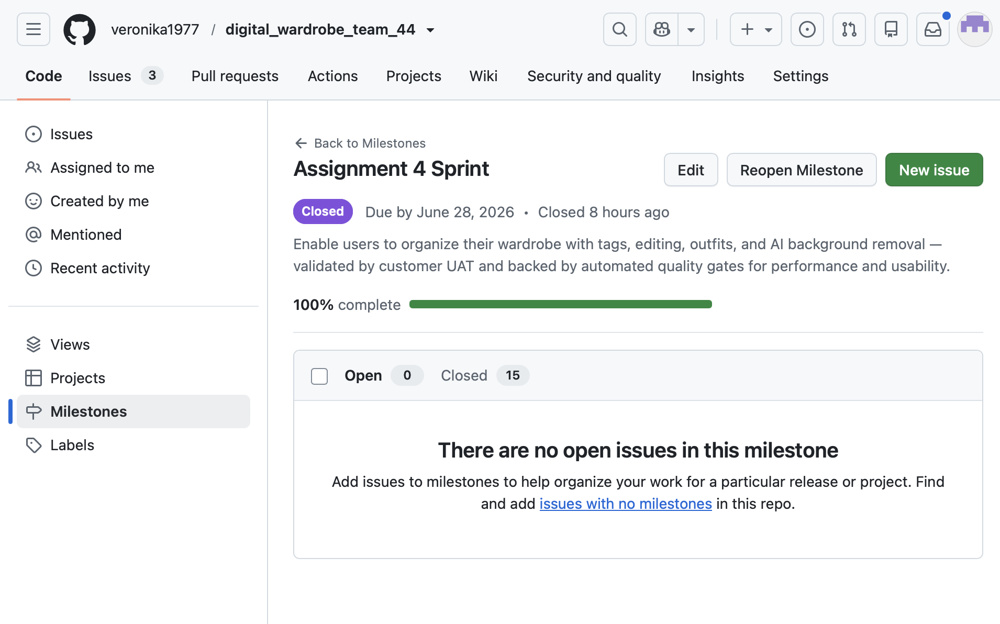

### Latest Protected CI Run
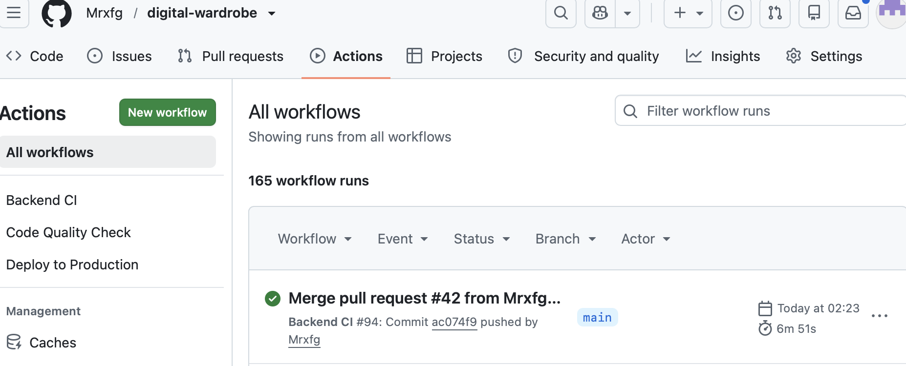

### Coverage Report
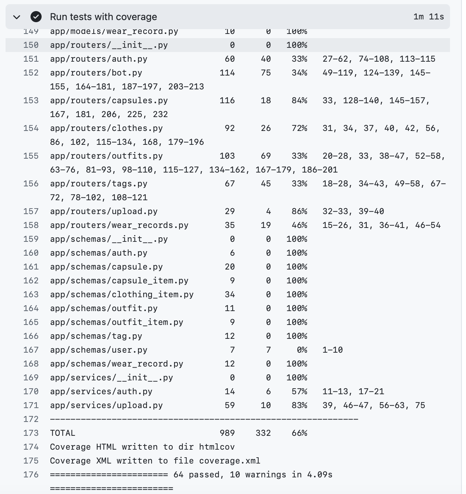

### Additional QA Check (Vulture)
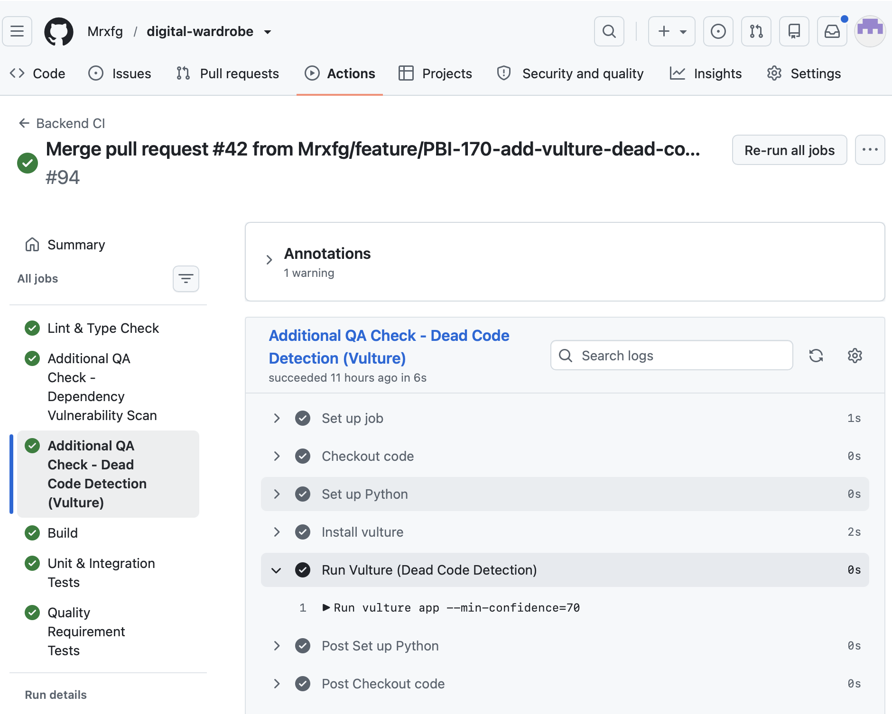


### Reviewed Issue-Linked PR
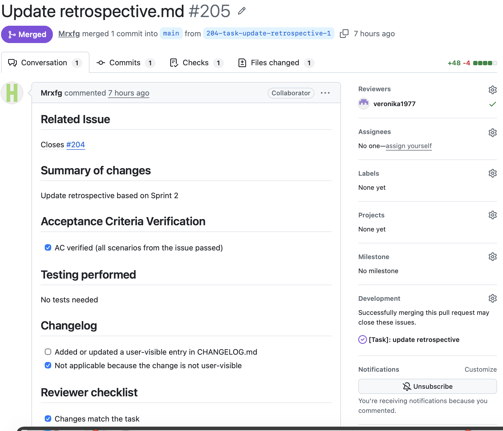
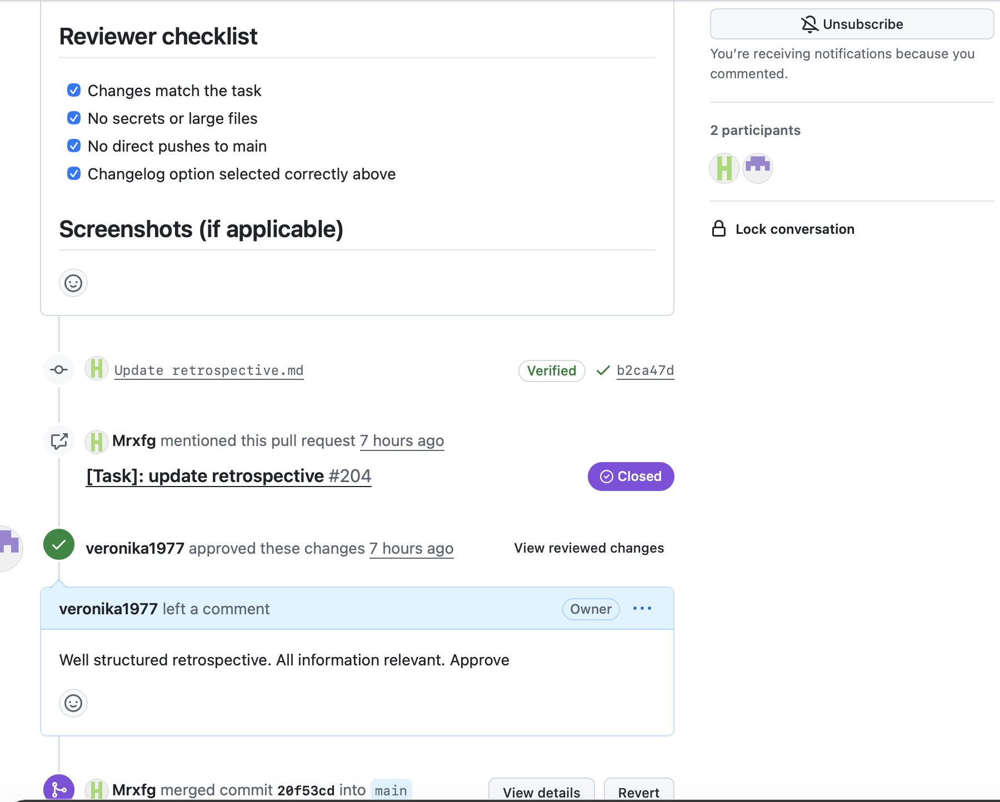