# Week 5 Report — Digital Wardrobe MVP v2

**Project:** Digital Wardrobe  
**Description:** Telegram Mini App for personal wardrobe management with AI background removal, weather integration, and calendar-based outfit planning.  
**Sprint:** 3 (MVP v2)  
**Dates:** 2026-06-24 to 2026-07-03  
**Sprint Goal:** Deliver US-12 (Weather Integration) and US-13 (Calendar Planning) with credible automated verification and architecture traceability.

---

## Navigation

### Backlogs and Milestones

- [Product Backlog Board](https://github.com/users/veronika1977/projects/1/views/1)
- [Sprint Backlog Board](https://github.com/users/veronika1977/projects/1/views/9)
- [Sprint 3 Milestone](https://github.com/veronika1977/digital_wardrobe_team_44/milestone/3)

### Sprint Metrics

- **Total Story Points:** 13 SP
- **Delivered Scope:** US-12 (Weather Integration), US-13 (Calendar Planning), architecture views update, QRT-004/005 implementation

### Product Access

- [Live Application: Telegram Mini App](https://t.me/digital_wardrobe_app_bot)
- [Run Instructions: docs/development-process.md]()

---

## Delivered Increment Summary

### MVP v2 Changes
See [CHANGELOG.md#mvp-v2](../../CHANGELOG.md#MVP-v2) for detailed release notes.

**Key additions:**

- Backend: `GET /api/user/location` endpoint (Telegram initData parsing + manual override)
- Frontend: Weather UI component with direct OpenWeatherMap API integration
- Backend: Capsule/outfit CRUD endpoints with date-state synchronization
- Frontend: Calendar view with green date indicator and instant outfit preview
- Architecture: Static, Dynamic, and Deployment views updated and rendered in CI
- Testing: QRT-004 (Weather) and QRT-005 (Calendar) automated tests passing

---

## Customer Feedback and Response

| Feedback Point | Resulting PBI or Issue | Status |
|---------------|----------------------|--------|
| Weather | - | - |
| Calendar | - | - |

### Feedback Not Addressed

- Multi-day weather forecast: Deferred to Sprint 6+ due to MVP scope focus on single-day integration and API quota management.
- AI stylist recommendations: Added to long-term backlog; requires additional model integration and user preference data collection.

---

## Documentation and Architecture Links

### Core Documentation

- [Roadmap](../../docs/roadmap.md)
- [Definition of Done](../../docs/definition-of-done.md)
- [Testing Status](../../docs/testing.md)
- [Quality Requirements](../../docs/quality-requirements.md)
- [Quality Requirement Tests](../../docs/quality-requirement-tests.md)
- [User Acceptance Tests](../../docs/user-acceptance-tests.md)
- [Development Process](../../docs/development-process.md)

### Architecture

- [Architecture Overview](../../docs/architecture/README.md)
- [Static View](../../docs/architecture/static-view/README.md) | [Diagram](../../docs/architecture/static-view/component-diagram.svg)
- [Dynamic View](../../docs/architecture/dynamic-view/README.md) | [Diagram](../../docs/architecture/dynamic-view/sequence-diagram.svg)
- [Deployment View](../../docs/architecture/deployment-view/README.md) | [Diagram](../../docs/architecture/deployment-view/deployment_diagram.svg)
- [ADR Directory](../../docs/architecture/adr/)

### Architecture Summary

The three-view architecture (Static, Dynamic, Deployment) provides a traceable foundation for the current product:
- **Static View** defines component boundaries and interfaces, enabling independent development and testing of frontend, backend services, and external integrations.
- **Dynamic View** traces critical user flows (authentication, item upload with Rembg fallback, weather fetch) to demonstrate fault tolerance and performance characteristics.
- **Deployment View** documents the runtime topology (Cloudflare Pages + Docker Compose on VPS), justifying technology choices for MVP scalability and operational simplicity.

### Quality Requirements and Architecture Decisions

Quality requirements QR-001 (response time), QR-002 (fault tolerance), and QR-003 (testability) are explicitly linked to architecture decisions:
- ADR-001 (FastAPI + PostgreSQL) enables async request handling (QR-001) and dependency injection for testability (QR-003).
- ADR-002 (CPU-based Rembg) defines the fallback mechanism that satisfies QR-002: original images are always preserved, and application remains operational when external processing fails.
- ADR-003 (Telegram Authentication) drives the JWT/HMAC flow that secures API access while maintaining low-latency user experience (QR-001).

---

## Testing and CI/CD Status

### Testing Summary for MVP v2

- **Automated Tests:** QRT-004 (Weather) and QRT-005 (Calendar) passing in CI
- **Coverage:** 51% overall backend coverage; critical modules (auth, items, capsules, weather) at 72-100%
- **UAT:** All five scenarios (UAT-001 to UAT-005) passed with customer validation
- **CI Gates:** black, flake8, mypy, eslint, tsc, lychee — all passing

### CI/CD Links

- [CI Pipeline: Backend](https://github.com/Mrxfg/digital-wardrobe/actions)
- [CI Pipeline: Frontend](https://github.com/veronika1977/digital_wardrobe_777/actions)
- [CI Pipeline: Documentation](https://github.com/veronika1977/digital_wardrobe_team_44/actions)
- [Latest Protected-Branch CI Run: Backend](https://github.com/Mrxfg/digital-wardrobe/actions)
- [Latest Protected-Branch CI Run: Documentation](https://github.com/veronika1977/digital_wardrobe_team_44/actions)

### Release and Changelog

- [SemVer Release: MVP v2](https://github.com/veronika1977/digital_wardrobe_team_44/releases/tag/v2.0.0)
- [CHANGELOG.md](../../CHANGELOG.md)

---

## Demonstration and Evidence

### Demo Video
[Public sanitized demo video](https://drive.google.com/drive/folders/1e94sniKBmWwJYCnyYjfly6F-1X1qXroW) 

### UAT Results Summary

See [User Acceptance Tests](../../docs/user-acceptance-tests.md) for detailed scenarios and results.

**Summary:**

- UAT-001 to UAT-003 (core wardrobe): All passed, customer confirmed intuitive workflow
- UAT-004 (Weather): Passed, weather loads within 3s
- UAT-005 (Calendar): Passed, outfit scheduling and green highlight function as expected

### Sprint Review Publication
- [Sprint Review Summary](./sprint-review-summary.md)
- [Sprint Review Transcript](./sprint-review-transcript.md)

---

## Deviations from Expected Artifacts

[TODO: If any artifact, evidence pattern, or access arrangement differs from the expected default, justify that deviation explicitly. Example:]
- Backend CI coverage report uses `htmlcov/` directory instead of uploading to external service due to MVP scope; full report available in CI artifacts.
- Demo video hosted on YouTube (public) for grader accessibility; alternative: share via Moodle if privacy required.

---

## Internal Report Links

- [Sprint Review Summary](./sprint-review-summary.md)
- [Reflection](./reflection.md)
- [Retrospective](./retrospective.md)
- [LLM Usage Report](./llm-report.md)

---

## Product Status and Next Steps

### Current Product Status

Digital Wardrobe MVP v2 is production-ready for the defined scope:
- Core wardrobe management (add, view, filter, delete items) — fully functional
- Background removal (best-effort with fallback) — operational with graceful degradation
- Weather integration (hybrid flow) — live, <3s response, fallback verified
- Calendar planning (outfit scheduling) — functional with instant UI sync
- Architecture documentation — complete with three views and ADR traceability
- Automated verification — credible coverage (51% overall) with QRTs for new features

### Next Steps

1. Add AI-stylist in app (US-14)
2. Create Telegram Bot notifications for daily outfis (US-15)
3. Monetization
4. Make task according customer feedback from UAT and Sprint 3 Review

---

## Contribution Traceability

## Contribution Traceability

| Team Member | Role | Issues | PRs | Reviews Given | Comments |
|-------------|------|--------|-----|--------------|----------|
| @veronika1977 | Scrum Master / Developer | [#214](https://github.com/veronika1977/digital_wardrobe_team_44/issues/214), [#216](https://github.com/veronika1977/digital_wardrobe_team_44/issues/216) (US-13), [#217](https://github.com/veronika1977/digital_wardrobe_team_44/issues/217) (US-14), [#218](https://github.com/veronika1977/digital_wardrobe_team_44/issues/218) (US-15), [#219](https://github.com/veronika1977/digital_wardrobe_team_44/issues/219), [#220](https://github.com/veronika1977/digital_wardrobe_team_44/issues/220), [#221](https://github.com/veronika1977/digital_wardrobe_team_44/issues/221), [#222](https://github.com/veronika1977/digital_wardrobe_team_44/issues/222), [#223](https://github.com/veronika1977/digital_wardrobe_team_44/issues/223), [#225](https://github.com/veronika1977/digital_wardrobe_team_44/issues/225), [#227](https://github.com/veronika1977/digital_wardrobe_team_44/issues/227), [#239](https://github.com/veronika1977/digital_wardrobe_team_44/issues/239), [#241](https://github.com/veronika1977/digital_wardrobe_team_44/issues/241) | [#215](https://github.com/veronika1977/digital_wardrobe_team_44/pull/215), [#240](https://github.com/veronika1977/digital_wardrobe_team_44/pull/240), [#242](https://github.com/veronika1977/digital_wardrobe_team_44/pull/242), [#243](https://github.com/veronika1977/digital_wardrobe_team_44/pull/243), [#244](https://github.com/veronika1977/digital_wardrobe_team_44/pull/244), [#226](https://github.com/veronika1977/digital_wardrobe_team_44/pull/226), [#228](https://github.com/veronika1977/digital_wardrobe_team_44/pull/228) | — | [#224](https://github.com/veronika1977/digital_wardrobe_team_44/pull/224#issuecomment-...) (meaningful), [#252](https://github.com/veronika1977/digital_wardrobe_team_44/pull/252#issuecomment-...) |
| @Evgeni1a | Developer | [#231](https://github.com/veronika1977/digital_wardrobe_team_44/issues/231), [#255](https://github.com/veronika1977/digital_wardrobe_team_44/issues/255#issue-4803325961) | [#232](https://github.com/veronika1977/digital_wardrobe_team_44/pull/232), [#233](https://github.com/veronika1977/digital_wardrobe_team_44/pull/233), [#245](https://github.com/veronika1977/digital_wardrobe_team_44/pull/245), [#256](https://github.com/veronika1977/digital_wardrobe_team_44/pull/256#issue-4803330394) | — | — |
| @Mrxfg | Developer | — | [#224](https://github.com/veronika1977/digital_wardrobe_team_44/pull/224) | [#215](https://github.com/veronika1977/digital_wardrobe_team_44/pull/215#pullrequestreview-...), [#228](https://github.com/veronika1977/digital_wardrobe_team_44/pull/228#pullrequestreview-...) | [#224](https://github.com/veronika1977/digital_wardrobe_team_44/pull/224#issuecomment-...) (meaningful) |
| @CatherineHar | Developer / Reviewer | — | — | [#240](https://github.com/veronika1977/digital_wardrobe_team_44/pull/240#pullrequestreview-...), [#242](https://github.com/veronika1977/digital_wardrobe_team_44/pull/242#pullrequestreview-...), [#243](https://github.com/veronika1977/digital_wardrobe_team_44/pull/243#pullrequestreview-...), [#226](https://github.com/veronika1977/digital_wardrobe_team_44/pull/226#pullrequestreview-...) | — |
| @DarinaLuch | Scrum Owner / Developer | [#248](https://github.com/veronika1977/digital_wardrobe_team_44/issues/248), [#249](https://github.com/veronika1977/digital_wardrobe_team_44/issues/249) | [#250](https://github.com/veronika1977/digital_wardrobe_team_44/pull/250), [#251](https://github.com/veronika1977/digital_wardrobe_team_44/pull/251) | [#252](https://github.com/veronika1977/digital_wardrobe_team_44/pull/252#issue-4801144689) | [#252](https://github.com/veronika1977/digital_wardrobe_team_44/pull/252#pullrequestreview-4623626087) |

---

## Embedded Screenshots

### Sprint Milestone

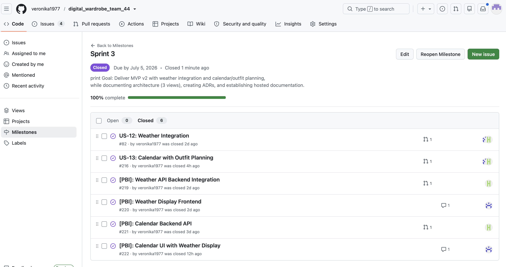

### Board View

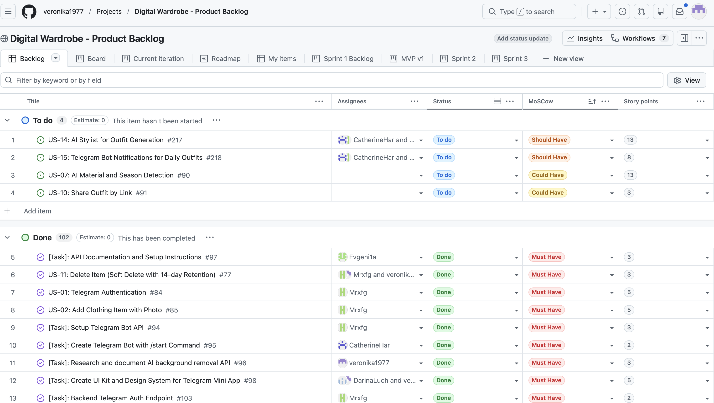

### Sprint 3 Board View

### CI Run Status

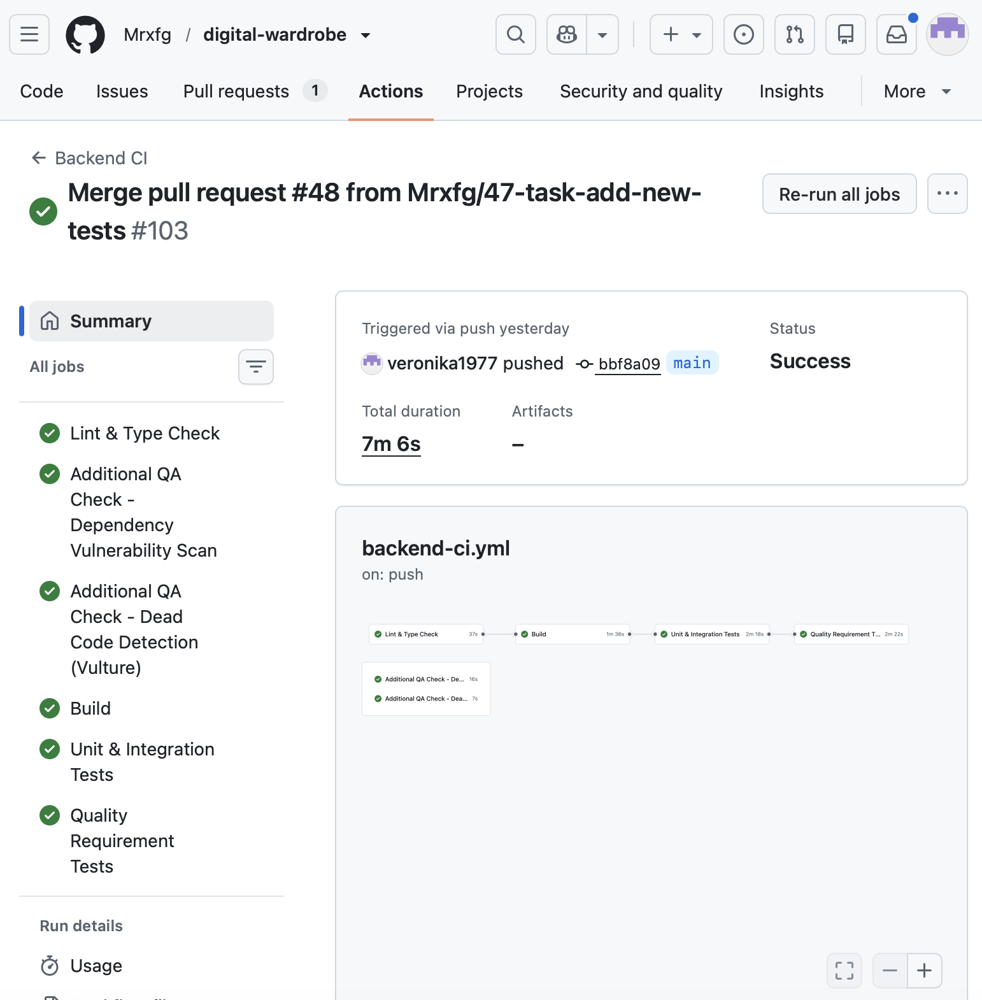

### SemVer Release

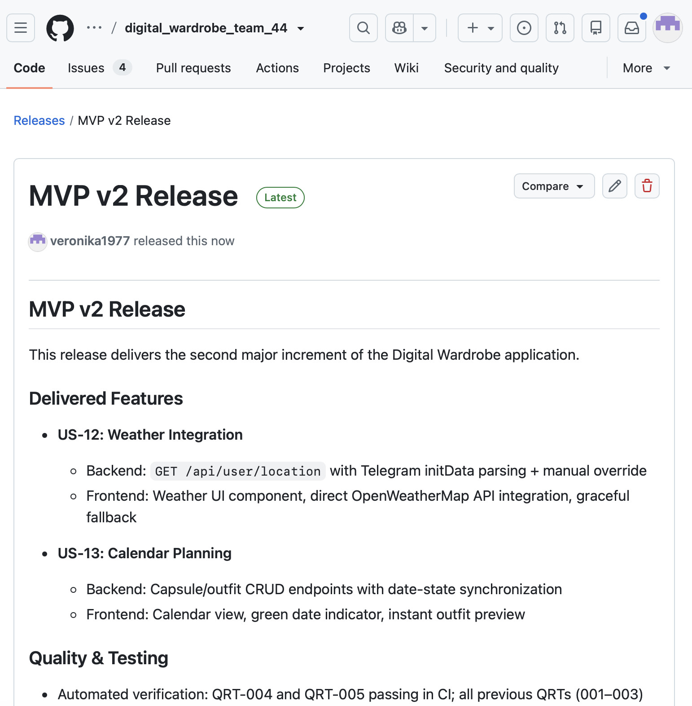

### Reviewed PR Example

### Product Access Artifact

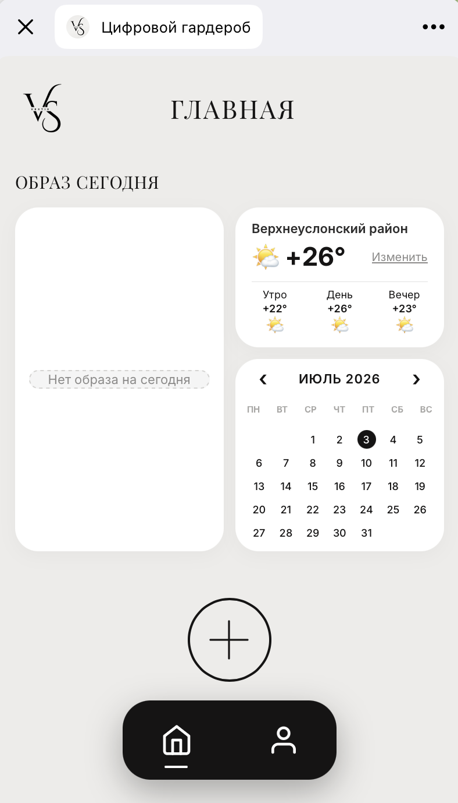

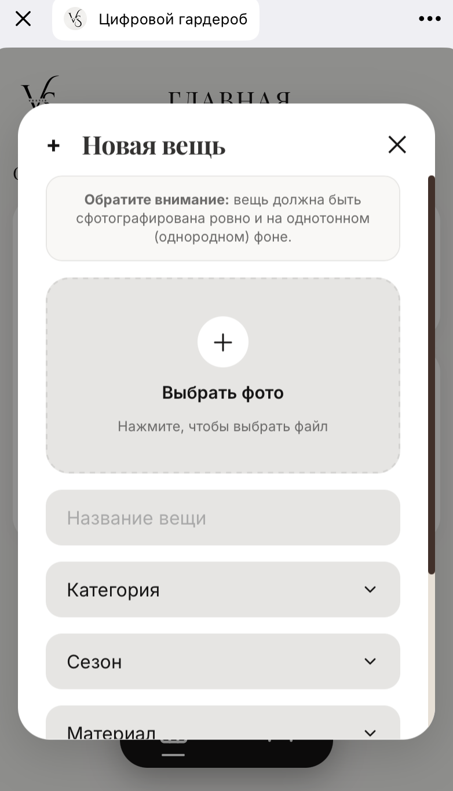

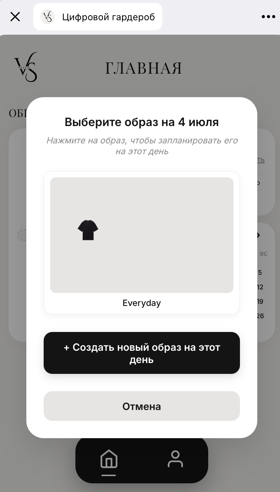

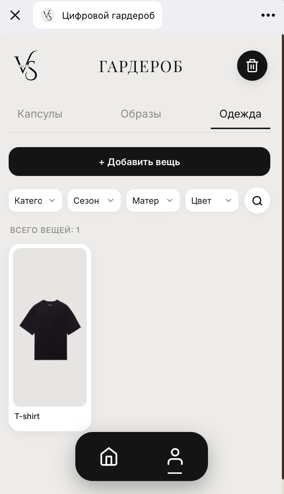

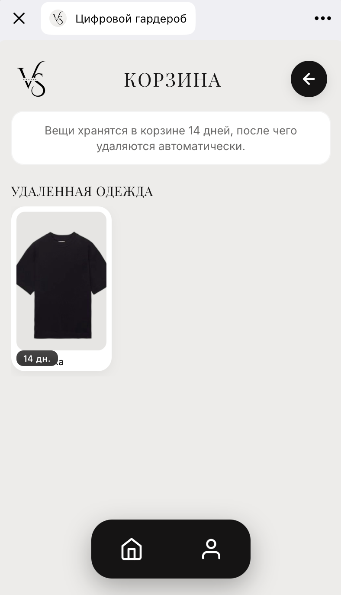

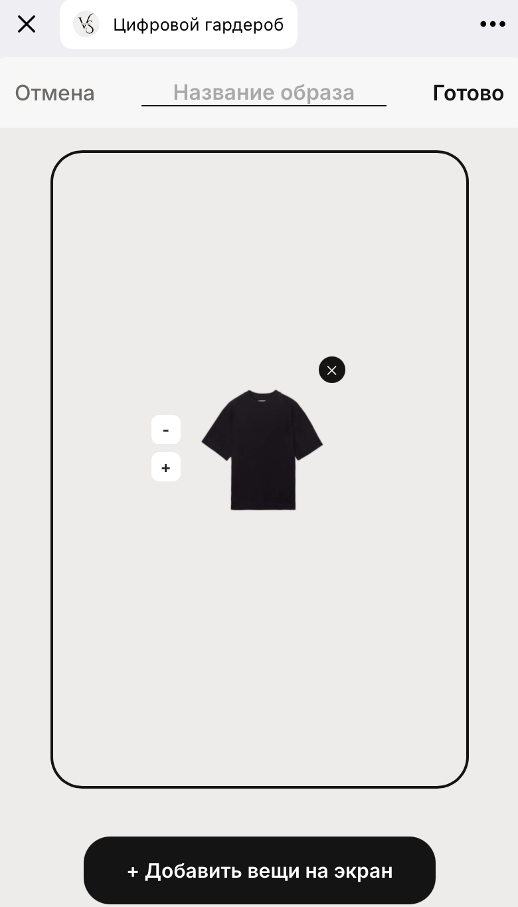

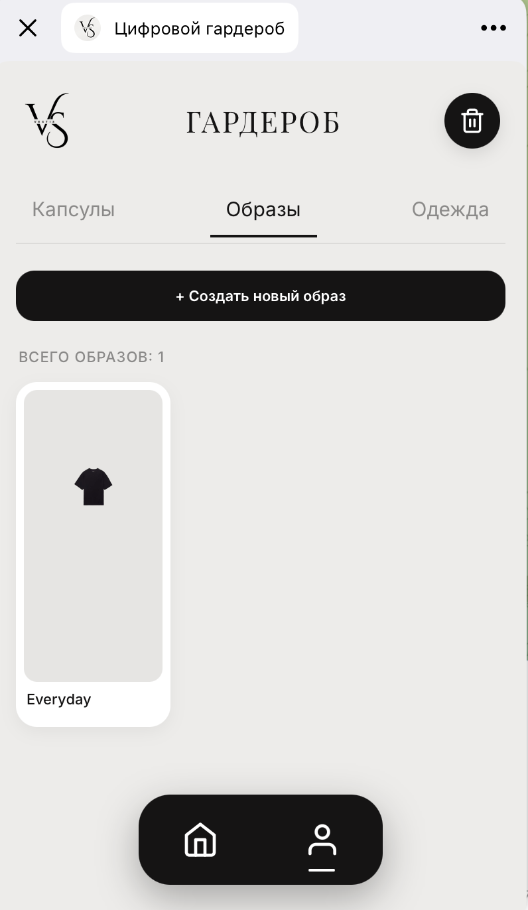

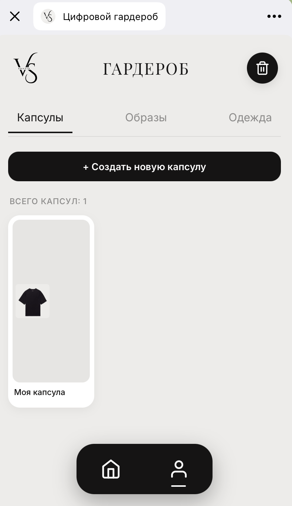

---

