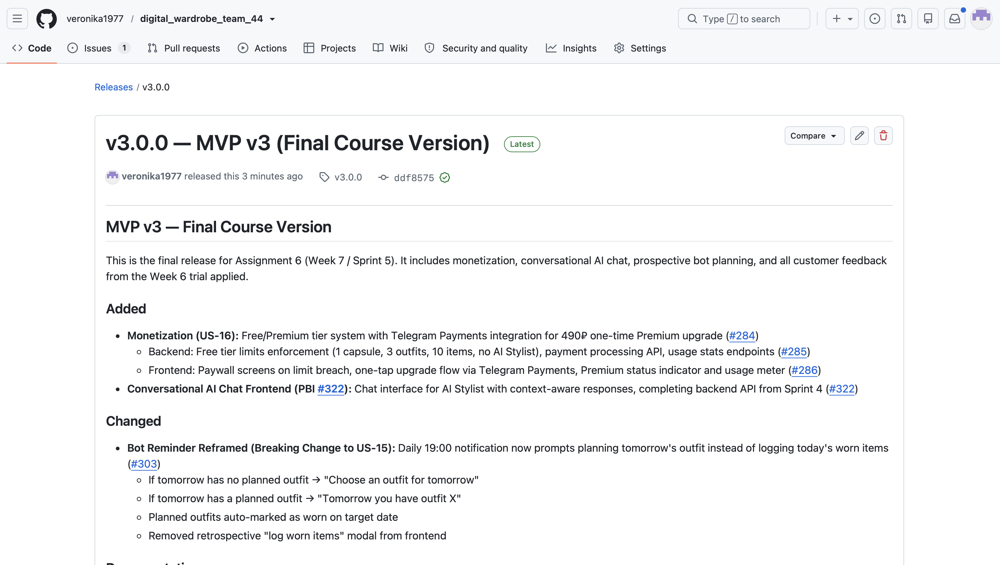
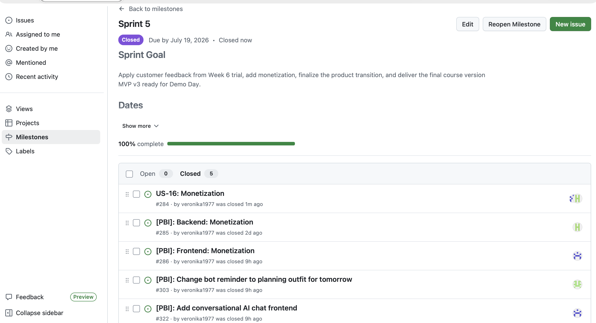
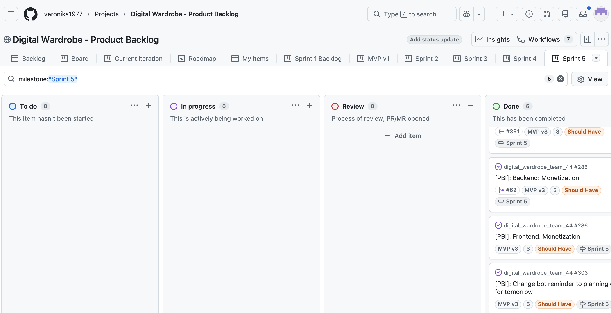
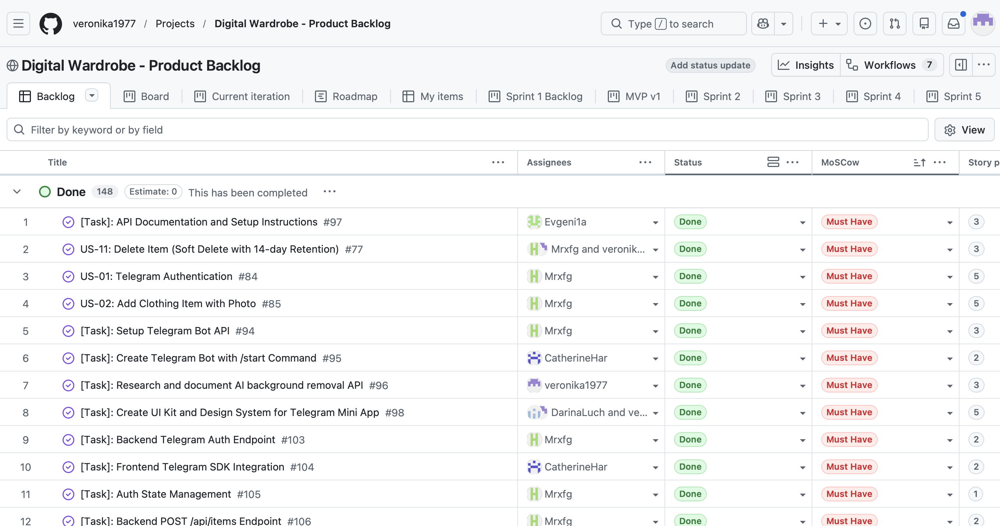
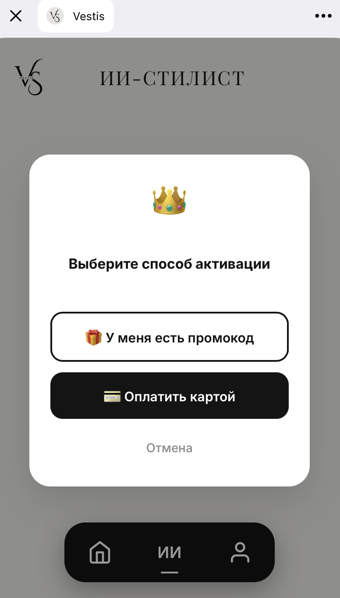
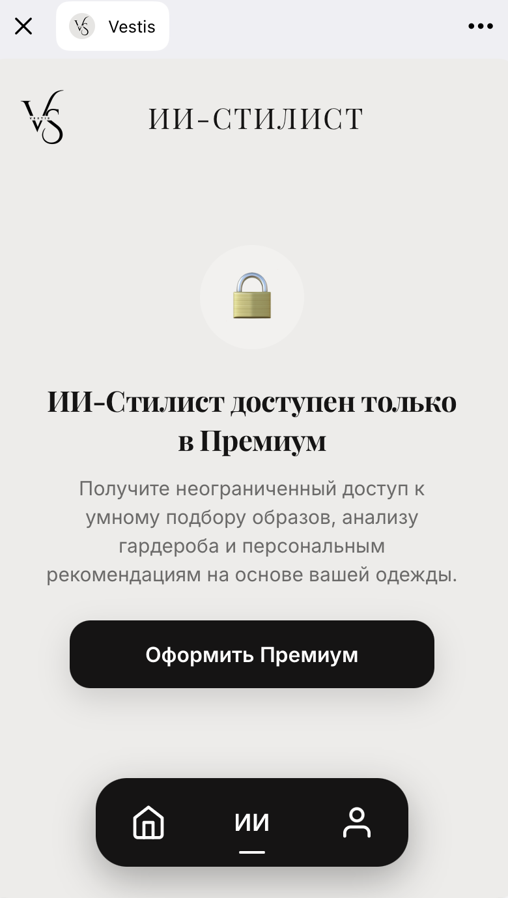
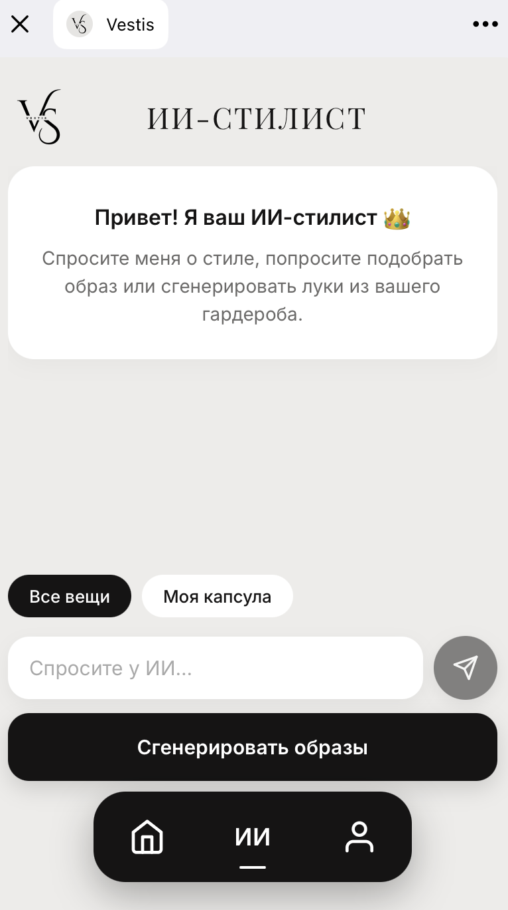
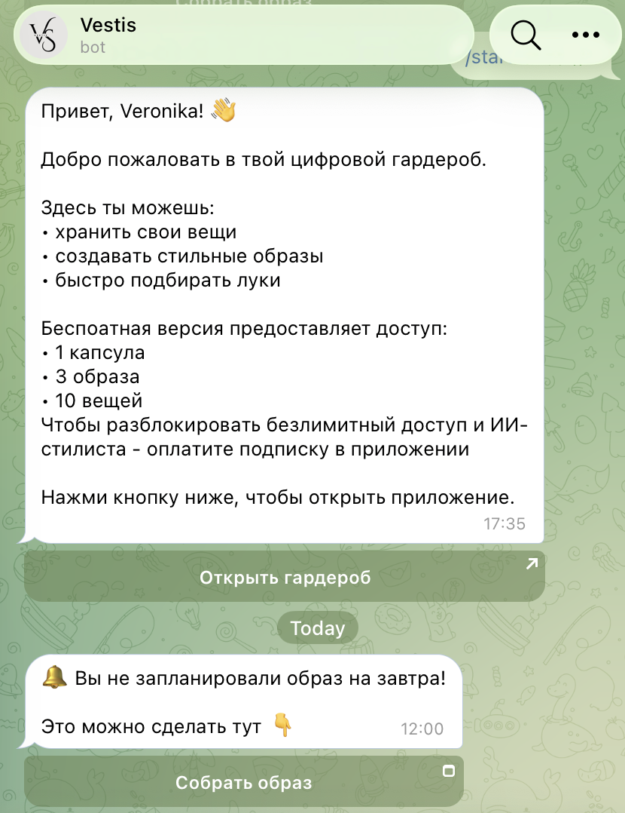
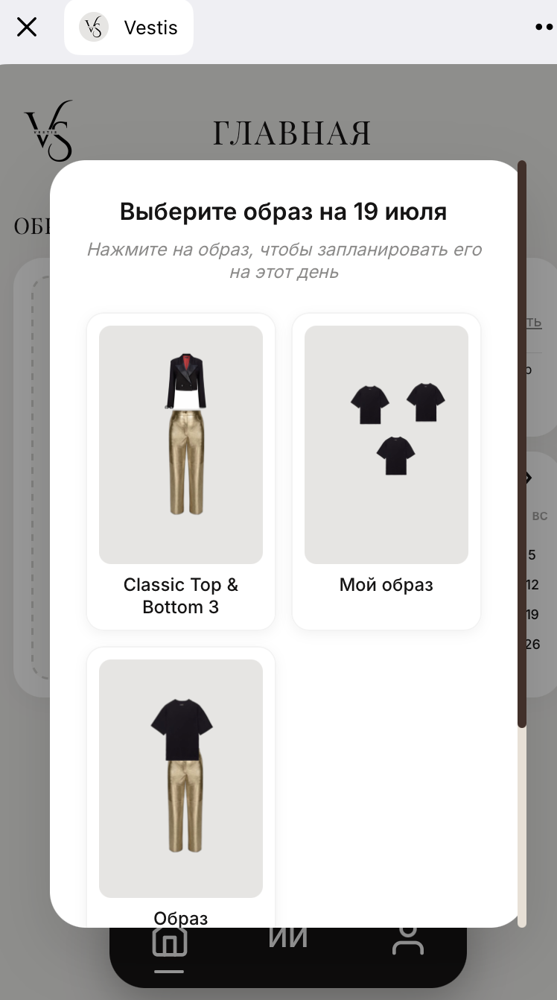

# Week 7 Public Report — Sprint 5: Final Delivery (MVP v3)

> **This is the final Assignment 6 submission index.**

> For full Week 6 trial release evidence, see [Week 6 Report](../week6/README.md).

## Project Overview

- **Project Name:** Digital Wardrobe (Team 44)
- **Product:** [@digital_wardrobe_app_bot](https://t.me/digital_wardrobe_app_bot)
- **Hosted Docs:** [GitHub Pages](https://veronika1977.github.io/digital_wardrobe_team_44/)
- **Final Release:** [v3.0.0 — MVP v3](https://github.com/veronika1977/digital_wardrobe_team_44/releases/tag/v3.0.0)
- **Public Demo Video (MVP v3):** [Google Drive](https://drive.google.com/drive/folders/1slmyk5JNNGHeZXyPf43AhcDTEw-fdkta?usp=share_link) 

---

## Week 6 Evidence (Linked, Not Duplicated)

| Artifact | Link |
|----------|------|
| Week 6 Public Report | [reports/week6/README.md](../week6/README.md) |
| Sprint Review Summary | [sprint-review-summary.md](../week6/sprint-review-summary.md) |
| Sprint Review Transcript | [sprint-review-transcript.md](../week6/sprint-review-transcript.md) |
| Reflection | [reflection.md](../week6/reflection.md) |
| Retrospective | [retrospective.md](../week6/retrospective.md) |
| LLM Report | [llm-report.md](../week6/llm-report.md) |

---

## Sprint 5 Scope & Planning

- **Sprint Goal:** Apply customer feedback from Week 6 trial, add monetization, finalize product transition, and deliver MVP v3 ready for Demo Day.
- **Dates:** 13.07.2026 – 19.07.2026
- **Total Story Points:** 16 SP
- **Milestone:** [Sprint 5](https://github.com/veronika1977/digital_wardrobe_team_44/milestone/5)
- **Backlog View:** [Sprint 5 Board](https://github.com/users/veronika1977/projects/1/views/11)

### Planned Items

| PBI | Title | SP | Assignee | Reviewer | Status |
|-----|-------|----|----------|----------|--------|
| [#284](https://github.com/veronika1977/digital_wardrobe_team_44/issues/284) | Monetization (US-16) | 8 | @Mrxfg | @CatherineHar, @Mrxfg | Done |
| [#285](https://github.com/veronika1977/digital_wardrobe_team_44/issues/285) | Monetization Backend Limits | 5 | @Mrxfg | @DarinaLuch | Done |
| [#286](https://github.com/veronika1977/digital_wardrobe_team_44/issues/286) | Monetization Frontend Paywall | 3 | @CatherineHar | @veronika1977 | Done |
| [#303](https://github.com/veronika1977/digital_wardrobe_team_44/issues/303) | Bot reminder → planning tomorrow | 5 | @Evgeni1a | @Mrxfg | Done |
| [#322](https://github.com/veronika1977/digital_wardrobe_team_44/issues/322) | Conversational AI chat frontend | 3 | @CatherineHar | @DarinaLuch | Done |

---

## Summary of Week 7 Changes (MVP v3)

### Added

- **Monetization (US-16):** Free/Premium tier system with Telegram Payments (490₽ one-time). Backend enforces limits (1 capsule, 3 outfits, 10 items, no AI Stylist for free users). Frontend displays paywall screens and one-tap upgrade flow. ([#284](https://github.com/veronika1977/digital_wardrobe_team_44/issues/284), [#285](https://github.com/veronika1977/digital_wardrobe_team_44/issues/285), [#286](https://github.com/veronika1977/digital_wardrobe_team_44/issues/286))
- **Conversational AI Chat Frontend:** Chat interface for AI Stylist with context-aware responses, completing backend API from Sprint 4. ([#322](https://github.com/veronika1977/digital_wardrobe_team_44/issues/322))

### Changed

- **Bot Reminder Reframed (Breaking Change to US-15):** Daily 19:00 notification now prompts planning tomorrow's outfit instead of logging today's worn items. Planned outfits auto-marked as worn on target date. Retrospective "log worn items" modal removed from frontend. ([#303](https://github.com/veronika1977/digital_wardrobe_team_44/issues/303))

---

## Final Transition Outcome

- **Handover Level Reached:** Ready for independent use
- **Customer Confirmation Status:** Accepted
- **What Was Transferred:**
  - Full product access via Telegram Mini App ([@digital_wardrobe_app_bot](https://t.me/digital_wardrobe_app_bot))
  - Hosted documentation site ([GitHub Pages](https://veronika1977.github.io/digital_wardrobe_team_44/))
  - [`docs/customer-handover.md`](../../docs/customer-handover.md) with setup/deployment instructions
- **Remaining Limitations:** US-07 (AI Material Detection) and US-10 (Share by Link) deferred to post-course as out of MVP scope

---

## Customer Feedback Response (Sprint 5 Follow-Up)

| Week 6 Feedback | PBI | Resolution in Sprint 5 |
|-----------------|-----|----------------------|
| Bot should prompt planning tomorrow, not log today | [#303](https://github.com/veronika1977/digital_wardrobe_team_44/issues/303) | Done — breaking change implemented |
| Want conversational AI chat, not just button | [#322](https://github.com/veronika1977/digital_wardrobe_team_44/issues/322) | Done — frontend chat UI completed |
| Monetization needed for long-term survival | [#284](https://github.com/veronika1977/digital_wardrobe_team_44/issues/284) | Done — Free/Premium tiers with Telegram Payments |

---

## UAT / Customer Trial Results (Week 7)

- Executed relevant UAT scenarios during final transition confirmation meeting
- **Result:** All 10 scenarios passed
- **Key Feedback:** «Все понятно сразу, вообще идеально» (All good)
- **Full UAT Document:** [docs/user-acceptance-tests.md](../../docs/user-acceptance-tests.md)

---

## Repository Entry Points

- [README.md](../../README.md)
- [CONTRIBUTING.md](../../CONTRIBUTING.md)
- [AGENTS.md](../../AGENTS.md)
- [docs/customer-handover.md](../../docs/customer-handover.md) *(updated with final handover level + confirmation status)*
- [Hosted Documentation](https://veronika1977.github.io/digital_wardrobe_team_44/)

---

## Release & Changelog

- **Final Release:** [v3.0.0](https://github.com/veronika1977/digital_wardrobe_team_44/releases/tag/v3.0.0)
- **Changelog:** [CHANGELOG.md](../../CHANGELOG.md)
- **Public Sanitized Demo Video:** [Google Drive](https://drive.google.com/drive/folders/1slmyk5JNNGHeZXyPf43AhcDTEw-fdkta?usp=share_link)

---

## Demo Day Preparation

- Slide deck prepared (private, submitted via Moodle PDF)
- Rehearsed presentation video recorded (private, submitted via Moodle)
- Week 7 lab rehearsal completed
- Week 8 Demo Day presentation scheduled (7+7 min)

---

## Sprint Review & Process Artifacts

| Artifact | Link |
|----------|------|
| Sprint Review Transcript | [sprint-review-transcript.md](./sprint-review-transcript.md) |
| Sprint Review Summary | [sprint-review-summary.md](./sprint-review-summary.md) |
| Reflection | [reflection.md](./reflection.md) |
| Retrospective | [retrospective.md](./retrospective.md) |
| LLM Report | [llm-report.md](./llm-report.md) |

---

## Final Product Status

MVP v3 is the final course version. All Sprint 5 PBIs completed. Product is ready for independent customer use. Handover documentation is current and confirmed by customer. Demo Day materials prepared.

---

## Contribution Traceability

| Team Member | Role | Issues | PRs | Reviews |
|-------------|------|--------|-----|---------|---------------------|
| @veronika1977 | Scrum Master | [#284](https://github.com/veronika1977/digital_wardrobe_team_44/issues/284#issue-4820828254), [#332](https://github.com/veronika1977/digital_wardrobe_team_44/issues/332), [#334](https://github.com/veronika1977/digital_wardrobe_team_44/issues/334), [#342](https://github.com/veronika1977/digital_wardrobe_team_44/issues/342) | [#331](https://github.com/veronika1977/digital_wardrobe_team_44/pull/331), [#333](https://github.com/veronika1977/digital_wardrobe_team_44/pull/333), [#335](https://github.com/veronika1977/digital_wardrobe_team_44/pull/335), [#345](https://github.com/veronika1977/digital_wardrobe_team_44/pull/345) | [#339](https://github.com/veronika1977/digital_wardrobe_team_44/pull/339#pullrequestreview-4723300132), [#341](https://github.com/veronika1977/digital_wardrobe_team_44/pull/341#pullrequestreview-4728699859), [#344](https://github.com/veronika1977/digital_wardrobe_team_44/pull/344#pullrequestreview-4728752064), [#349](https://github.com/veronika1977/digital_wardrobe_team_44/pull/349#pullrequestreview-4728811564) |
| @Mrxfg | Developer |  [#346](https://github.com/veronika1977/digital_wardrobe_team_44/issues/346) | [#347](https://github.com/veronika1977/digital_wardrobe_team_44/pull/347) | [#345](https://github.com/veronika1977/digital_wardrobe_team_44/pull/345#pullrequestreview-4728742418) |
| @Evgeni1a | Developer | [#340](https://github.com/veronika1977/digital_wardrobe_team_44/issues/340), [#343](https://github.com/veronika1977/digital_wardrobe_team_44/issues/343)| [#341](https://github.com/veronika1977/digital_wardrobe_team_44/pull/341), [#344](https://github.com/veronika1977/digital_wardrobe_team_44/pull/344) | [#333](https://github.com/veronika1977/digital_wardrobe_team_44/pull/333#issue-4905039778) |
| @CatherineHar | Developer | [#348](https://github.com/veronika1977/digital_wardrobe_team_44/issues/348) | [#349](https://github.com/veronika1977/digital_wardrobe_team_44/pull/349) | [#331](https://github.com/veronika1977/digital_wardrobe_team_44/pull/331#pullrequestreview-4716669654), [#335](https://github.com/veronika1977/digital_wardrobe_team_44/pull/335#issue-4905370742) |
| @DarinaLuch | Product Owner | [#338](https://github.com/veronika1977/digital_wardrobe_team_44/issues/338) | [#339](https://github.com/veronika1977/digital_wardrobe_team_44/pull/339) | [#347](https://github.com/veronika1977/digital_wardrobe_team_44/pull/347#pullrequestreview-4728800330) |

---

## Evidence Screenshots

